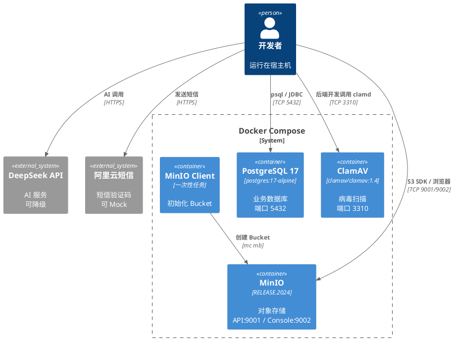

# 开发环境准备

> 本文档说明如何搭建智能档案管理系统的本地开发环境。核心基础设施（PostgreSQL、MinIO）通过 Docker Compose 统一编排，后端 Spring Boot 和前端 Vite 在宿主机直接运行以便热重载调试。

## 1. 基础工具

| 项目 | 最低版本 | 验证命令 |
|------|---------|----------|
| JDK | 17+ (LTS) | `java -version` |
| Node.js | 20.19+ 或 22.12+ | `node -v` |
| 包管理器 | npm 或 pnpm | `npm -v` / `pnpm -v` |
| Docker | Docker Engine 24+ + Docker Compose v2 | `docker --version` && `docker compose version` |
| Git | 2.x | `git --version` |

Arch Linux 安装参考：

```bash
paru -S jdk17-openjdk nodejs-lts-iron npm docker docker-compose git
sudo systemctl enable --now docker
sudo usermod -aG docker $USER   # 执行后需重新登录
```

## 2. Docker 服务架构

开发环境使用 Docker Compose 管理四个容器：

| 服务 | 镜像 | 端口 | 用途 |
|------|------|------|------|
| `postgres` | `postgres:17-alpine` | `5432` | 业务数据库 |
| `minio` | `quay.io/minio/minio:RELEASE.2024-12-18T13-15-44Z` | `9001`（S3 API）/ `9002`（控制台） | 电子文件对象存储 |
| `clamav` | `clamav/clamav:1.4` | `3310`（仅绑定宿主机回环地址） | 文件上传病毒扫描 |
| `minio-init` | `quay.io/minio/mc:RELEASE.2024-11-21T17-21-54Z` | — | 首次启动自动创建 Bucket（一次性任务） |

图 2-1 开发环境 Docker 服务架构



图 2-1 开发环境 Docker 服务架构

### 2.1 环境变量约定

项目根目录提供 [`.env.example`](../../.env.example) 作为模板，首次使用需复制：

```bash
cp .env.example .env
```

关键变量说明：

| 变量 | 用途 | 注意事项 |
|------|------|----------|
| `DB_HOST` / `DB_PORT` / `DB_NAME` / `DB_USER` / `DB_PASSWORD` | PostgreSQL 连接 | 本地开发 `DB_HOST=localhost` |
| `MINIO_ROOT_USER` / `MINIO_ROOT_PASSWORD` | MinIO 管理员凭证 | 此为 2024+ 新版变量名，旧版 `MINIO_ACCESS_KEY` / `MINIO_SECRET_KEY` 已废弃 |
| `MINIO_ENDPOINT` | MinIO S3 API 地址 | 宿主机用 `http://localhost:9001`；容器内服务间通信用 `http://minio:9002` |
| `MINIO_API_PORT` / `MINIO_CONSOLE_PORT` | MinIO 对外端口 | 仅在端口冲突时修改 |
| `CLAMAV_HOST` / `CLAMAV_PORT` | ClamAV clamd 地址 | 宿主机 Spring Boot 用 `localhost:3310`；容器内服务间通信用 `clamav:3310` |
| `CLAMD_STARTUP_TIMEOUT` / `FRESHCLAM_CHECKS` | ClamAV 启动等待和病毒库检查频率 | 首次加载病毒库较慢，保留较长启动等待 |
| `SPRING_PROFILES_ACTIVE` | Spring 环境标识 | 固定 `dev` |
| `DEEPSEEK_API_KEY` | AI 服务密钥 | 可为空，为空时系统降级为手动模式 |
| `ALIYUN_SMS_ACCESS_KEY` / `ALIYUN_SMS_SECRET` | 短信服务凭证 | 可为空，为空时验证码输出到日志 |

### 2.2 Docker Compose 配置要点

以下为当前配置的关键设计决策及依据：

**PostgreSQL：**

- **镜像选择 `postgres:17-alpine`**：PostgreSQL 17 文档和生态成熟度足够；较早版本支持周期更短，不再作为默认开发版本。
- **认证方式 `scram-sha-256`**：PG 14+ 默认值，比 `md5` 更安全，比 `trust` 安全得多。仅当客户端不支持 SHA-256 时才需降级。
- **健康检查 `pg_isready`**：官方镜像内置的轻量级就绪检测命令，不依赖完整认证，适合编排依赖。`depends_on: condition: service_healthy` 依赖此检查。
- **共享内存 `shm_size: 128mb`**：PostgreSQL 依赖共享内存进行进程间通信，默认 64MB 在并发查询较多时可能不够，128MB 适合开发及轻负载场景。
- **初始化脚本目录 `doc/pre-environment/docker/init-db/`**：在 `doc/pre-environment/docker-compose.yml` 中以相对路径 `./docker/init-db` 映射到容器内 `/docker-entrypoint-initdb.d/`，仅在数据目录为空（首次启动）时自动执行其中的 `.sql` 和 `.sh` 文件。表结构与种子数据应由 Flyway 迁移管理，此目录仅放扩展创建等基础操作。

**MinIO：**

- **环境变量 `MINIO_ROOT_USER` / `MINIO_ROOT_PASSWORD`**：2024 年起 MinIO 官方废弃了旧的 `MINIO_ACCESS_KEY` / `MINIO_SECRET_KEY`，统一使用 `MINIO_ROOT_*` 系列变量。Spring Boot 侧 MinIO 客户端配置中，`access-key` 对应 `MINIO_ROOT_USER`，`secret-key` 对应 `MINIO_ROOT_PASSWORD`。
- **健康检查 `mc ready local`**：新版 MinIO 镜像不再内置 `curl`，旧版 `curl -f http://localhost:9001/minio/health/live` 方式已不可用。`mc` 是 MinIO 官方命令行客户端，`mc ready local` 是推荐的容器健康检查命令。
- **镜像标签使用 RELEASE 固定版本**：`RELEASE.2024-12-18T13-15-44Z` 是具体发布标签，避免 `latest` 浮动带来的不可预期变更。
- **Bucket 初始化使用独立 `mc` 容器**：MinIO 官方镜像不支持通过环境变量自动创建 Bucket。使用 `quay.io/minio/mc`（MinIO Client）作为一次性初始化容器，通过 `depends_on: minio: condition: service_healthy` 确保 MinIO 就绪后再创建。`--ignore-existing` 标志保证重复执行（如重启或重建容器）时不会报错。

**ClamAV：**

- **镜像选择 `clamav/clamav:1.4`**：ClamAV 1.4 是当前 LTS 特性版本，官方支持关键补丁到 2027-08-15，病毒库下载允许到 2028-08-15。固定在 1.4 特性版本，避免 `stable` 自动跨特性版本。
- **端口绑定 `127.0.0.1:${CLAMAV_PORT}:3310`**：官方文档提醒 `clamd` TCP 没有加密和鉴权。开发环境为了宿主机 Spring Boot 调用，仅绑定本机回环地址；生产容器化部署时应只走 Docker 内网 `clamav:3310`。
- **病毒库卷 `clamav_data`**：持久化 `/var/lib/clamav`，避免每次重建容器都重新下载完整病毒库。
- **启动耗时与内存**：ClamAV 首次加载病毒库较慢，并且官方建议至少 3 GiB、优先 4 GiB 可用内存。本项目上传接收阶段必须扫描通过；开发机内存不足时可以暂缓测试上传流程，但不能把接收上传降级为未扫描通过。

## 3. 操作手册

### 3.1 启动基础设施

```bash
# 进入正式仓库根目录
cd /path/to/Intelligent-file-management-system

# 首次使用：复制环境变量模板
cp .env.example .env

# 启动所有 Docker 服务
docker compose --env-file .env -f doc/pre-environment/docker-compose.yml up -d

# 查看服务状态
docker compose --env-file .env -f doc/pre-environment/docker-compose.yml ps

# 查看日志
docker compose --env-file .env -f doc/pre-environment/docker-compose.yml logs -f postgres
docker compose --env-file .env -f doc/pre-environment/docker-compose.yml logs -f minio
```

### 3.2 验证服务

```bash
# PostgreSQL 连接测试
psql -h localhost -p 5432 -U archive_user -d archive_db
# 或
docker compose --env-file .env -f doc/pre-environment/docker-compose.yml exec postgres psql -U archive_user -d archive_db

# MinIO 控制台
# 浏览器访问 http://localhost:9002
# 使用 .env 中 MINIO_ROOT_USER / MINIO_ROOT_PASSWORD 登录

# MinIO S3 API 测试
curl http://localhost:9001/minio/health/live
# 预期返回: 200 OK

# 确认 Bucket 已创建（在 MinIO 控制台查看或执行）
docker compose --env-file .env -f doc/pre-environment/docker-compose.yml exec minio mc ls local/
```

### 3.3 查看与清理

```bash
# 停止所有服务（保留数据）
docker compose --env-file .env -f doc/pre-environment/docker-compose.yml down

# 停止并删除所有数据（重新初始化）
docker compose --env-file .env -f doc/pre-environment/docker-compose.yml down -v

# 查看数据卷
docker volume ls | grep archive
```

### 3.4 端口冲突处理

若默认端口被占用，编辑 `.env` 修改以下变量：

```bash
DB_PORT=5433              # PostgreSQL 端口冲突时
MINIO_API_PORT=9002       # S3 API 端口冲突时
MINIO_CONSOLE_PORT=9003   # 控制台端口冲突时
```

修改后执行 `docker compose --env-file .env -f doc/pre-environment/docker-compose.yml down && docker compose --env-file .env -f doc/pre-environment/docker-compose.yml up -d` 重建容器。

## 4. 后端 Spring Boot 启动

### 4.1 application-dev.yml 关键配置

```yaml
spring:
  datasource:
    url: jdbc:postgresql://${DB_HOST:localhost}:${DB_PORT:5432}/${DB_NAME:archive_db}
    username: ${DB_USER:archive_user}
    password: ${DB_PASSWORD:archive_pass_2024}

minio:
  endpoint: ${MINIO_ENDPOINT:http://localhost:9001}
  access-key: ${MINIO_ROOT_USER:minioadmin}
  secret-key: ${MINIO_ROOT_PASSWORD:minioadmin123}
```

注意：`minio.access-key` 对应 Docker 侧的 `MINIO_ROOT_USER`，`minio.secret-key` 对应 `MINIO_ROOT_PASSWORD`。

### 4.2 启动步骤

```bash
# 在项目根目录执行
cd backend
./mvnw spring-boot:run -Dspring-boot.run.profiles=dev
# 或
java -jar target/app.jar --spring.profiles.active=dev
```

验证：`curl http://localhost:8080/api/health`

## 5. 前端 Vite 启动

```bash
# 在项目根目录执行
cd frontend
npm install   # 或 pnpm install
npm run dev   # 或 pnpm dev
```

Vite 开发服务器默认端口 `5173`，通过 Vite 代理转发 `/api/*` 到后端 `localhost:8080`，开发阶段无需 Nginx。

## 6. 降级策略

本项目主流程强依赖 PostgreSQL、MinIO 和 ClamAV。PostgreSQL 不可用时后端无法启动业务接口；MinIO 不可用时文件上传、预览、下载和归档不可用；ClamAV 不可用时接收上传必须失败，不能创建可用暂存文件。以下外部依赖可以降级：

| 依赖 | 降级方式 | 影响范围 |
|------|---------|----------|
| DeepSeek API | `DEEPSEEK_API_KEY` 为空时，AI 按钮隐藏或禁用，用户可手动填写元数据 | 元数据补全、自然语言检索、数据研判三个 AI 功能不可用 |
| 阿里云短信 | `ALIYUN_SMS_ACCESS_KEY` 为空时，验证码输出到后端日志，本地开发使用固定验证码 `888888` | 公众注册/登录的短信验证环节 |

## 7. 初始化数据

数据库表结构和种子数据由 Flyway 迁移脚本统一管理，首次启动后端时自动执行。初始化数据至少包含：

| 数据 | 要求 |
|------|------|
| 分类 | 固定五类：文书档案、科技档案、会计档案、音像档案、人事档案 |
| 权限 | 本期不初始化逐按钮原子权限；接口按预设角色、密级和数据范围校验 |
| 角色 | 7 个预设角色：前台管理员、后台管理员、移交单位经办人、内部查阅者、社会公众、馆领导、系统管理员 |
| 管理员账号 | 至少 1 个档案管理员，`max_security_level=4`，`data_scope=all` |
| 馆领导 | 至少 1 个，角色为 `director` |
| 系统管理员 | 至少 1 个，角色为 `sys_admin` |
| 内部查阅者 | 至少 2 个，分别绑定不同 `organization_id` |
| 移交单位 | 至少 2 个，关联全宗 |
| 全宗 | 至少 2 个样例 |
| 库房架位 | 至少 1 个库房及样例架位 |

## 8. 联调前检查

| 检查项 | 通过标准 |
|--------|----------|
| Docker 服务 | `docker compose --env-file .env -f doc/pre-environment/docker-compose.yml ps` 全部 `healthy` |
| 后端启动 | `GET /api/health` 返回 200 |
| 数据库连接 | 后端成功执行 Flyway 迁移 |
| MinIO 上传 | 能通过 S3 SDK 上传临时文件并计算 SHA-256 |
| ClamAV 扫描 | 上传测试文件时能得到 `safe` 扫描结果；服务不可用时上传接口返回失败，不创建可用文件记录，只写审计日志 |
| 文件归档 | 确认入库后对象从 `_staging` 归档到正式路径 |
| 权限过滤 | 公众（security_level=0+open）、内部（maxSecurityLevel+dataScope）、管理员（all）数据范围不同 |
| AI 降级 | 未配置 `DEEPSEEK_API_KEY` 时接收和检索流程仍可完成 |
| 短信降级 | 未配置短信时公众注册和密码重置不阻塞 |

## 9. 可延后项

以下能力不阻塞第一轮开发，后续迭代中逐步补充：

- ClamAV 生产级性能调优或替代扫描引擎
- 远程异地备份
- 跨单位非公开查阅申请与授权闭环
- 大文件预签名 URL 直传
- Redis、消息队列、全文检索（Elasticsearch）、向量检索
