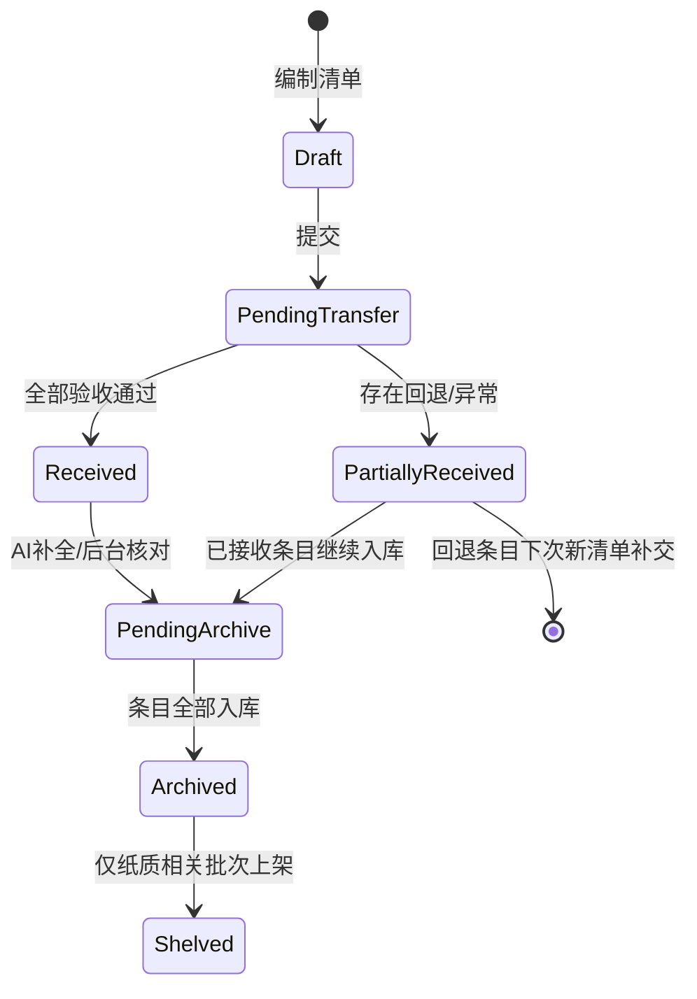
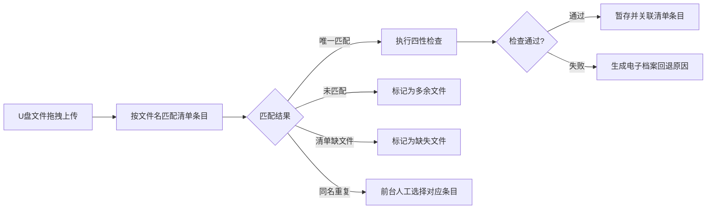
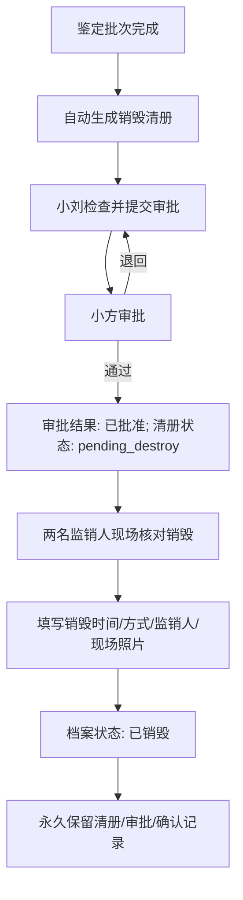
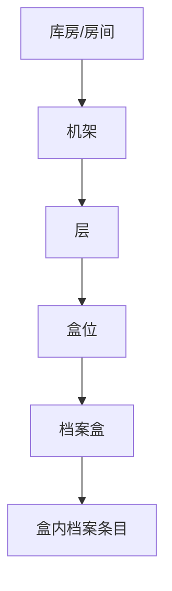
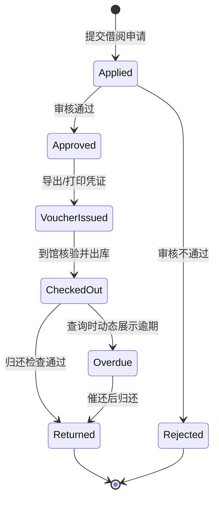

# 业务场景

本文档描述智能档案管理系统中各类用户的使用场景，明确"谁在什么情况下用什么功能做什么事"。以二次理清的角色模型和流程设计为准。

---

## 纸电融合管理模式

系统中的档案分为三类载体状态：
- **纯电子档案**：仅有电子版，无纸质原件（如原生电子文件）
- **纸质+电子档案**：同时有纸质原件和电子扫描件
- **纯纸质档案**：仅有纸质原件，尚未完成数字化

| 载体 | 存储位置 | 用途 |
|------|---------|------|
| **纸质原件** | 档案馆库房架位 | 原始凭证、法律效力、长期保管 |
| **电子文件** | MinIO 对象存储 | 在线检索、远程利用、备份 |

开发时要区分“载体状态”和“电子文件格式”两个概念：

| 概念 | 字段含义 | 示例 |
|------|---------|------|
| **载体状态** | 档案是否有纸质原件、是否有关联电子文件 | 纯电子 / 纸质+电子 / 纯纸质 |
| **电子文件格式** | 电子文件本体的格式或扩展名 | PDF / DOCX / JPG / MP4 |

移交单位侧拖拽文件只能解析文件名、扩展名和文件大小，不能仅凭拖拽动作判断是否存在纸质原件。因此，拖拽文件只辅助填写「档案标题」「档案文件名」「电子文件格式」，「载体状态」仍由经办人选择或确认。

---

### 移交阶段的数据流

移交清单在系统中不是最终档案记录，而是**预入库数据 + 线下交接凭证**：移交单位先填清单，前台按清单核对实物并上传电子文件，后台 AI 补全正式入库所缺字段后入库上架。

| 数据线 | 移交单位侧 | 档案馆前台（小陈） | 档案馆后台（小刘） | 系统记录 |
|--------|-----------|-------------------|-------------------|----------|
| **清单数据** | 小张在线编制，提交 | 按清单逐项验收，标记回退 | AI 补全缺失字段，核对后入库 | 移交批次、清单明细、状态 |
| **纸质原件** | 整理，在移交日带到前台 | 人工清点数量、检查质量 | 装盒、分配架位、上架 | 盒号、架位、物理状态 |
| **电子文件** | 整理到 U 盘，与纸质文件一并带到前台 | 拖拽到系统上传（四性检查） | 关联档案记录 | 文件路径、哈希值、格式 |
| **签字凭证** | 导出打印清单 | 导出打印回执，盖章交还 | — | 交接时间、双方确认 |

移交单位填写的密级、保管期限、是否公开等业务判断字段 AI 不可覆盖，管理员如需调整应退回补正。

---

## 用户角色总览

| 角色 | 代表 | 是谁 | 使用频率 | 核心定位 |
|------|------|------|---------|---------|
| **档案管理员（前台）** | 小陈 | 档案馆前台人员 | 每天 | 接待移交/捐赠、清点核对、上传电子文件、导出回执 |
| **档案管理员（后台）** | 小刘 | 档案馆后台人员 | 每天 | AI 补全、装盒入库上架、库房管理、鉴定销毁、审批处理 |
| **移交单位经办人** | 小张 | 企事业单位档案移交负责人 | 每年 1-2 次 | 编制移交清单、线下交接 |
| **内部查阅者** | 小李 | 与小张同单位的人员 | 按需 | 检索档案、在线预览、申请借阅 |
| **社会公众** | 小周 | 在平台注册账号的公众 | 按需 | 检索公开档案、提交捐赠意向 |
| **馆领导** | 小方 | 档案馆领导 | 按需 | 销毁审批、密级调整审批、开放调整审批 |
| **系统管理员** | — | IT 人员 | 偶尔 | 用户管理、系统配置 |

> 说明：小陈和小刘在实际工作中可以是一个人，系统不强制区分前后台角色。三员分立（系统管理员、安全保密员、安全审计员）为可选启用模式，小规模部署时可合并。

### 权限矩阵

权限控制以角色为基础，以后端接口鉴权为准。前端菜单只负责隐藏不可用入口，不能作为安全边界。

| 角色 | 可访问模块 | 可新增/提交 | 可编辑 | 可审批/执行 | 可查看/下载范围 |
|------|-----------|-------------|--------|-------------|----------------|
| 档案管理员（前台） | 移交验收、征集接收、电子文件上传、回执导出、借阅出库/归还 | 验收记录、回退原因、暂存电子文件、接收回执 | 前台验收信息、文件匹配结果、归还检查说明 | 确认接收、确认出库、确认归还 | 可查看验收和借阅所需档案信息；架位只对管理员展示 |
| 档案管理员（后台） | 档案入库、档案管理、库房、盘点、鉴定、销毁、借阅审批、统计研判、保存管理 | 正式档案、盒号/架位、鉴定批次、销毁清册、盘点任务、编研成果 | 题名、责任者、形成日期、分类、标签等非受保护字段 | 借阅审批、鉴定结论、提交销毁清册、确认销毁 | 按管理员权限查看馆藏档案；密级/公开调整仍需走审批 |
| 移交单位经办人 | 移交单位门户、移交清单、个人工作台 | 移交清单、清单条目、凭证档案移交清单 | 本单位未提交的草稿清单；提交后的清单只读（待移交、已接收、部分接收、已入库、已上架、已回退） | 提交清单、导出移交清单 | 仅查看本单位、本账号相关移交清单和回执 |
| 内部查阅者 | 内部检索、档案详情、在线预览、下载、借阅申请、个人工作台 | 借阅申请 | 本人申请中的联系方式、借阅理由等 | 无审批权限 | 后端按密级上限、所属单位/全宗范围和档案生命周期过滤；`open_status` 只控制公众开放；不显示具体架位 |
| 社会公众 | 公众首页、公开档案检索、公众概览、征集清单 | 注册信息、征集清单、捐赠意向 | 本人未提交的草稿征集清单和个人信息；提交后的征集清单只读（待联系、待接收、部分接收、已接收、已拒绝） | 无审批权限 | 仅查看非密、公开、生命周期状态为正常的正式档案；下载电子文件需登录 |
| 馆领导 | 审批工作台、审批详情、统计概览 | 审批意见 | 本人审批意见提交前可修改 | 密级调整审批、开放调整审批、销毁审批 | 可查看审批所需目标档案、凭证档案、清册快照 |
| 系统管理员 | 用户管理、角色权限、系统配置、日志审计 | 用户、角色、配置项 | 用户状态、权限配置、系统参数 | 不参与档案业务审批 | 默认不直接查看档案正文和电子文件，除非同时授予档案业务角色 |

受保护字段包括密级、保管期限、是否公开、是否允许数字化、档号、架位、销毁状态。普通元数据编辑、AI 补全和批量研判都不能直接覆盖受保护字段；需要调整时走对应业务流程并永久留痕。

---

## 开发实现口径与复杂度边界

本系统按毕业设计和小规模档案馆实际使用场景控制复杂度：优先把主流程做闭环，把复杂例外做成可人工处理的异常状态，不为了少量极端情况提前引入过重的流程引擎。

| 主题 | 本期必须落地 | 暂不展开/后续讨论 |
|------|-------------|------------------|
| 批次与条目状态 | 清单批次和清单条目分开记录状态，允许同一批里部分接收、部分回退 | 多轮补正版本链只保留必要快照，不做复杂协同编辑 |
| 清单与正式档案 | 移交/征集清单只是预入库数据，管理员确认入库后才生成正式档案 | 不提前为退回条目占用正式档号 |
| 电子文件匹配 | 只能依靠文件名、扩展名和人工确认；系统提供未匹配、重复匹配、缺失匹配提示 | 不做内容识别、OCR 自动比对或语义匹配 |
| AI 字段补全 | AI 按默认 50 条拆分清单条目，逐批生成可补全字段；白名单过滤后写入 `ai_suggestion`，管理员核查 | 不让 AI 直接写库，不让 AI 覆盖密级、保管期限、公开状态 |
| 凭证档号审批 | 密级/公开调整只输入凭证档号，系统校验凭证存在并展示给馆领导 | 不做外部文件二次上传流程 |
| 捐赠在线协议 | 征集提交时在线勾选同意捐赠协议，系统记录同意时间 | 不做纸质协议签署、扫描和编号管理 |
| 销毁 | 馆局一体口径下，馆领导审批即本馆批准凭证；清册、审批、监销记录永久保存 | 不引入第三方审批节点，若甲方要求可作为配置项补充 |
| 借阅 | 借阅申请、审批、凭证、出库、归还形成闭环 | 不做复杂跨馆借阅或物流流程 |
| 库房 | 按房间-机架-层-盒数生成架位，满足当前可想象物理模型 | 不预设复杂密集架厂商结构，后续可扩展区/列/节 |

### 开发统一口径

| 对象 | 生成时机 | 开发说明 |
|------|---------|---------|
| **移交/征集清单** | 移交单位或公众提交时生成 | 属于预入库数据，不生成正式档号 |
| **清单条目** | 清单编制时逐条生成 | 条目可接收、回退、异常，状态要与清单批次分开 |
| **暂存电子文件** | 前台验收上传时生成 | 存入 MinIO 暂存路径，记录原文件名、哈希、格式、匹配状态 |
| **正式档案** | 后台管理员确认入库时生成 | 此时生成正式档号；回退条目不占用档号；纯电子档案入库后直接进入检索利用范围，纸质档案未上架前不进入检索和借阅范围 |
| **正式电子文件记录** | 正式档案生成后创建 | 从暂存对象归档到正式路径，写入 `archive_files` |
| **纸质架位记录** | 纸质档案确认入库时生成或确认 | 纯电子档案不需要架位；纸质+电子和纯纸质档案入库时必须填写盒号和架位，并立即预占架位 |

电子文件接收阶段的“四性检查”本期按最小可实现口径处理：

| 检查项 | 本期实现 |
|--------|---------|
| 完整性 | 计算 SHA-256 哈希，记录文件大小和对象路径 |
| 可用性 | 校验扩展名/格式白名单，必要时尝试打开或解析基础文件头 |
| 真实性 | 预留数字签名/验签记录字段；没有外部签名体系时不强制验签 |
| 安全性 | 接入 ClamAV 或同等病毒扫描组件；上传必须扫描通过，扫描服务不可用、超时、失败或命中病毒时拒绝接收 |

AI 能力在业务场景中只作为增强能力：AI 不可用时，所有补全字段都可以由管理员手工填写；AI 返回结果必须进入 JSON 白名单过滤和人工确认，不能直接写正式档案。

载体状态决定页面按钮和后端校验口径：

| 载体状态 | 在线预览 | 下载电子文件 | 纸质借阅 | 盒号/架位 | 入库后可见性 |
|----------|----------|--------------|----------|-----------|-------------|
| 纯电子档案 | 有权限且文件已归档时可预览 | 有权限且文件已归档时可下载 | 不支持 | 不需要 | 确认入库后进入检索利用范围 |
| 纸质+电子档案 | 有权限且文件已归档时可预览 | 有权限且文件已归档时可下载 | 支持，需审批 | 入库时必须填写并预占 | 点击「已上架」后才进入检索和借阅范围 |
| 纯纸质档案 | 不支持电子正文预览 | 不支持电子文件下载 | 支持，需审批 | 入库时必须填写并预占 | 点击「已上架」后才进入检索和借阅范围 |

纸质相关档案在“已入库但未上架”阶段已有正式档号、盒号和预占架位记录，但只能由管理员在入库/上架页面查看，不向内部查阅者和公众检索结果开放，也不能发起借阅。确认上架时不重新选择架位，只确认实物已放入入库时预占的架位。

状态实现时建议至少拆成五类对象，避免把所有状态塞进一个字段：

| 对象 | 典型状态 | 说明 |
|------|---------|------|
| 移交清单批次 | `status`：草稿、待移交、已接收、部分接收、已入库、已上架 最近 AI 任务状态：running、partial_completed、completed、failed | 控制整批流程；后台“待入库”列表由批次状态和条目入库情况计算，AI 补全任务状态来自 `ai_tasks`；纯电子批次入库后保持“已入库”，不进入“已上架” |
| 清单条目 | 草稿、待验收、已接收、已回退、待入库、已入库 | 支持同一批次部分接收 |
| 电子文件 | 未上传、暂存、匹配成功、匹配异常、已归档、已删除 | 文件状态独立于档案状态 |
| 正式档案 | 已入库未上架、正常、借出、待销毁、已销毁 | 入库后才出现；盘点状态由运行中的盘点任务动态判断 |
| 审批单/清册 | 审批单：待审批、已退回、已批准；销毁清册：待提交、待审批、待销毁、已销毁 | 密级调整、开放调整、销毁等审批使用 |

### 主流程状态流转表

以下表格用于开发拆分接口和按钮行为，不是数据库表结构设计。实现时要保证“批次状态”和“条目状态”分开更新，批次状态可由条目状态汇总得到，也可存储冗余状态但必须保持一致。

后台“待入库”列表查询批次状态为“已接收/部分接收”且仍存在未入库已接收条目的清单，并按最近 AI 任务状态区分：未开始、`running`、`partial_completed`、`completed`、`failed`。管理员进入批次后按当前阶段展示对应操作按钮和表单状态。

| 对象 | 当前状态 | 操作 | 操作人 | 下一状态 | 副作用/说明 |
|------|---------|------|--------|----------|-------------|
| 移交清单批次 | 草稿 | 提交清单 | 移交单位经办人 | 待移交 | 生成清单号，可导出 PDF 清单 |
| 清单条目 | 草稿 | 批次提交 | 移交单位经办人 | 待验收 | 条目随批次进入前台验收范围 |
| 移交清单批次 | 待移交 | 全部验收通过 | 前台管理员 | 已接收 | 可导出接收回执，进入后台待入库 |
| 移交清单批次 | 待移交 | 部分条目回退 | 前台管理员 | 部分接收 | 已接收条目继续入库，回退条目写入回执 |
| 清单条目 | 待验收 | 验收通过 | 前台管理员 | 已接收 | 纸质实物核对通过，电子文件可进入暂存匹配 |
| 清单条目 | 待验收 | 回退 | 前台管理员 | 已回退 | 必须填写回退原因；下次由移交单位新建清单补交 |
| 暂存电子文件 | 未上传 | 前台上传 | 前台管理员 | 暂存 | 写入暂存对象路径、原文件名、大小、哈希 |
| 暂存电子文件 | 暂存 | 唯一匹配且检查通过 | 系统/前台管理员 | 匹配成功 | 关联清单条目，等待后台入库归档 |
| 暂存电子文件 | 暂存 | 未匹配/重复/缺失/检查失败 | 系统/前台管理员 | 匹配异常 | 前台人工确认、重新匹配或回退条目 |
| 暂存电子文件 | 暂存/匹配异常 | 条目回退 | 前台管理员 | 已删除 | 立即物理删除 MinIO 暂存对象，保留 `staging_files` 记录并写入审计日志 |
| 清单条目 | 已接收 | AI 补全并人工确认 | 后台管理员 | 待入库 | AI 按默认 50 条拆批，只生成白名单字段；管理员确认后进入入库表单 |
| 清单条目 | 待入库 | 确认入库 | 后台管理员 | 已入库 | 生成正式档案和正式档号；暂存文件归档为正式电子文件 |
| 移交清单批次 | 已接收/部分接收 | 已接收条目全部入库 | 后台管理员 | 已入库 | 回退条目不占用正式档号 |
| 移交清单批次 | 已入库 | 纸质档案上架确认 | 后台管理员 | 已上架 | 仅包含纸质相关档案的批次展示上架确认；纸质相关条目入库时已记录盒号/预占架位，上架后才开放检索和借阅 |
| 正式档案 | 已入库未上架 | 纸质档案上架确认 | 后台管理员 | 正常 | 纸质档案上架后进入检索和借阅范围 |
| 征集清单批次 | 草稿 | 提交捐赠意向 | 社会公众 | 待联系 | 进入后台征集页面 |
| 征集清单批次 | 待联系 | 约定到馆时间 | 后台管理员 | 待接收 | 记录联系结果和约定时间 |
| 征集清单批次 | 待联系 | 拒绝 | 后台管理员 | 已拒绝 | 填写拒绝理由，流程结束 |
| 征集清单批次 | 待接收 | 到馆验收通过 | 前台管理员 | 已接收 | 校验提交时已有在线捐赠协议同意记录，可导出回执 |
| 征集清单批次 | 待接收 | 部分条目回退 | 前台管理员 | 部分接收 | 有价值条目继续入库；不接收条目写入回执，公众端不可编辑原清单 |
| 正式档案 | 正常 | 提交借阅申请 | 内部查阅者 | 正常 | 生成借阅申请，不改变档案状态 |
| 借阅申请 | 待审批 | 审批通过 | 后台管理员 | 已批准 | 通知申请人导出凭证，到馆取件 |
| 正式档案 | 正常 | 确认出库 | 前台/后台管理员 | 借出 | 写入借出时间、应还时间、经办人 |
| 正式档案 | 借出 | 确认归还 | 前台/后台管理员 | 正常 | 写入归还时间和实体检查结果 |
| 正式档案 | 正常 | 创建盘点任务命中范围 | 后台管理员 | 正常 | 不修改档案主状态；借阅审批动态检查进行中的盘点范围 |
| 盘点任务 | 运行中 | 提交盘点结果 | 后台管理员 | 已完成 | 异常项记录缺失、错位、损坏等结果 |
| 正式档案 | 正常 | 鉴定为待销毁 | 后台管理员 | 待销毁 | 自动进入销毁清册生成范围 |
| 销毁清册 | 待提交 | 提交审批 | 后台管理员 | 待审批 | 清册内档案快照固定，不随档案后续编辑变化 |
| 销毁清册 | 待审批 | 审批退回 | 馆领导 | 待提交 | 保留退回意见 |
| 销毁清册 | 待审批 | 审批通过 | 馆领导 | 待销毁 | 审批单状态记为已批准，清册状态记为 `pending_destroy` 并进入待销毁列表 |
| 正式档案 | 待销毁 | 确认销毁 | 后台管理员 | 已销毁 | 电子文件按策略物理或逻辑删除，元数据、清册、审批和日志永久保留 |
| 审批单 | 待审批 | 密级/开放调整通过 | 馆领导 | 已批准 | 目标档案字段生效，写入调整前后值和凭证档号 |
| 审批单 | 待审批 | 密级/开放调整退回 | 馆领导 | 已退回 | 目标档案字段不变，保留退回意见 |

---

## 场景一：业务部门移交档案

**角色：** 小张（移交单位经办人）、小陈（前台档案管理员）、小刘（后台档案管理员）

**场景：** 财务部小张需要将 2025 年度的会计档案移交给档案馆。

### 一、编制清单

小张登录移交单位门户，进入移交清单页面，填写移交清单。

**清单级字段：**

| 字段 | 说明 |
|------|------|
| 清单标题 | 小张自行填写 |
| 移交单位 | 取自账号的企事业单位名称，只读 |
| 移交部门 | 取自账号部门，可修改 |
| 经办人 | 取自账号姓名，只读 |
| 联系电话 | 取自账号联系电话，可修改 |
| 档案所属年度 | 如"2025" |
| 移交日期 | 预计到馆移交的日期 |

**清单条目字段：**

| 字段 | 说明 |
|------|------|
| 档案标题 | 电子档案拖拽后自动填充文件名，可修改 |
| 档案页数 | 纸质档案填写 |
| 档案保管期限 | 永久/30 年/10 年 |
| 载体状态 | 纯电子/纸质+电子/纯纸质，由经办人选择或确认 |
| 电子文件格式 | 电子档案拖拽后自动识别扩展名，可修改 |
| 保密级别 | 非密/内部/秘密/机密/绝密 |
| 是否公开 | 非保密档案可选 |
| 是否允许数字化 | 纸质档案可选 |
| 档案文件名 | 电子档案拖拽后自动填充 |
| 档案形成日期 | 补充填写 |

对于电子档案，小张将文件拖拽到页面指定区域，系统自动提取文件名和扩展名，填充到「档案标题」「档案文件名」「电子文件格式」字段。此时系统**不接收文件**——只解析文件名，不上传文件本体。小张再补充载体状态、页数、保管期限、密级等字段。

> 开发口径：移交单位侧只能取得文件名，因此本期不做内容级自动匹配。文件名只是预填依据，真正接收时由前台在上传区完成“文件名匹配 + 人工确认”。

### 二、提交与导出

小张填好清单后点击提交，清单状态变为「待移交」。系统弹出弹窗，可选立即导出电子清单。也可以之后到工作台导出。

点击导出后，系统生成一份 PDF 文件——上半部分是表格式清单，下半部分预留了双方签字盖章区。

小张打印清单，在移交日期将纸质档案、存有电子文件的 U 盘、打印好的清单一并带到档案馆前台。

### 三、前台清点与电子文件上传（小陈）

小陈收到清单和实物后，在系统中打开该清单，开始逐条核对：

- **纸质档案**：核对数量、页数、装订、破损情况。异常的条目点击「回退」，填写回退原因。
- **电子档案**：将 U 盘中的电子文件全部选中，拖拽到清单页面的上传区域。系统按清单中的「档案文件名」做匹配，并展示匹配结果。文件打不开、同名重复、清单有文件但 U 盘缺失、U 盘有文件但清单无对应项时，系统标为异常，交由小陈确认后生成回退标记。

核对完毕后，小陈点击「已接收」。如果所有条目均通过，清单状态变为「已接收」；如果存在回退条目，清单状态为「部分接收」，已接收条目继续进入后台入库，回退条目写入回执。

若回退条目已上传暂存电子文件，系统立即物理删除对应 MinIO 暂存对象，但保留 `staging_files` 记录，将 `match_status` 标记为 `deleted`，并记录审计日志，便于事后追溯。

小陈点击「导出回执」，系统生成一份 PDF 回执——包含已接收条目列表和回退条目列表（含回退原因）。小陈打印回执、盖章，交给小张。如有回退，小张下次起一个新清单重新走流程。

### 四、后台入库（小刘）

小陈将清单和纸质档案交给小刘。

#### AI 整批补全

小刘在系统中打开该清单。若此前没有 AI 任务，页面展示“未开始”；若已有 AI 任务，则展示最近一次 AI 任务状态和批次完成情况。页面不展示逐条 AI 交互控件，只展示清单条目列表和已接收的字段。

小刘点击「AI 补全」按钮，系统按默认 50 条将已接收条目拆成多个 AI 批次，任务状态变为 `running`，页面展示处理中状态。每个批次独立调用 AI、独立校验 JSON、独立写入建议结果。

当所有批次成功时，任务状态变为 `completed`；当部分批次成功、部分失败时，任务状态变为 `partial_completed`；当全部批次失败或任务无法启动时，任务状态变为 `failed`。处于 `partial_completed` 的任务允许点击「重试失败批次」，系统只重试失败批次；全部失败批次成功后，任务状态变为 `completed`。

AI 补全通过 `intake_items.ai_suggestion`（JSONB）逐条落库，前端同时展示补全结果。**AI 不覆盖经办人已填的任何字段**（密级、保管期限、是否公开、是否允许数字化等受保护字段）。AI 响应中若出现受保护字段的键，后台白名单中间件直接剥离。

#### 核查与入库

AI 补全完成后，所有条目的表单已完整展示。小刘逐条核查，对不合理的字段直接编辑修正。

- **纯电子档案**：小陈已上传电子文件，确认字段无误后小刘点击「入库」，正式档案进入检索利用范围。
- **纸质+电子档案 / 纯纸质档案**：确认字段无误后，将纸质文件装入档案盒，填写盒号和架位，点击「入库」。此时系统生成正式档号并预占架位，但档案仍处于”已入库未上架”，不对查阅者开放检索和借阅。

正式档案的保管期限从入库日期起算：`10y`、`30y` 根据 `archived_at` 计算到期日写入 `retention_until`，永久保管档案的 `retention_until` 为空。

#### 上架

全部入库完毕后，系统生成一份完整字段的清单。如果批次中包含纸质相关档案，小刘拿着装好盒的档案和清单到库房，把档案放上入库时已预占的架位。回到系统点击「已上架」，清单状态变为「已上架」，纸质相关档案进入检索和借阅范围。纯电子批次入库后保持「已入库」，不展示上架按钮。

整个接收流程完成。

**业务规则：**
- AI 为任务级补全，不是逐条交互。管理员只在批次级触发一次 AI 任务
- AI 任务状态为：未开始、`running`、`partial_completed`、`completed`、`failed`
- `partial_completed` 支持重试失败批次；重试时不重复处理已成功批次
- AI 只补全缺失的入库字段（题名、责任者、形成日期、分类、标签），不得覆盖经办人填写的业务判断字段
- AI 字段保护由后端 JSON 白名单实现，不依赖提示词约束
- 移交单位不直接上传电子文件到系统，电子文件通过 U 盘随纸质文件线下移交，由前台统一上传
- 电子文件拖拽只解析文件名，不实际接收文件——防止账号泄露导致恶意上传
- 移交清单是”线上数据 + 线下签字凭证”：线上版本用于状态跟踪，打印签字版用于正式交接
- 电子文件只能按文件名进行自动匹配，异常匹配必须由前台人工确认或回退
- 纸质档案入库时必须填写盒号和架位并预占架位，确认上架后才能被检索和借阅；纯电子批次入库后保持“已入库”，不进入“已上架”
- 已提交、已接收、部分接收、已回退的移交清单不可再由移交单位编辑；回退条目下次新建清单补交
- 一般在文件形成次年 6 月底前完成移交

---

## 场景二：社会征集与捐赠

**角色：** 小周（社会公众）、小刘（后台档案管理员）、小陈（前台档案管理员）

**场景：** 档案馆发布征集公告后，小周看到公告，愿意捐赠一批老照片和文件。

### 一、提交捐赠意向

小周登录公众门户，进入征集清单页面，填写征集清单。

**清单级字段：**

| 字段 | 说明 |
|------|------|
| 清单标题 | 小周自行填写 |
| 捐赠人 | 必填，方便联系时称呼 |
| 联系电话 | 取自账号联系电话，可修改 |

**清单条目字段：**

| 字段 | 说明 |
|------|------|
| 档案标题 | 电子档案拖拽后自动填充文件名，可修改 |
| 档案页数 | 填写 |
| 载体状态 | 纯电子/纸质+电子/纯纸质，由捐赠人选择或确认 |
| 电子文件格式 | 电子档案拖拽后自动识别扩展名，可修改 |
| 档案文件名 | 电子档案拖拽后自动填充 |
| 档案形成日期 | 补充填写 |

电子档案拖拽行为与小张移交一样——只解析文件名，不接收文件。

征集档案的目标属性固定为：**永久保管期限、无保密等级、公开**。不需要小周填写密级和保管期限。

小周提交前需勾选同意在线捐赠协议，系统记录同意时间。协议文案由系统管理员在系统配置中维护，内容至少涵盖：捐赠人声明材料来源合法、权属清晰、同意无偿捐赠、允许档案馆公开利用。

> 开发口径：这不表示小周提交后立即公开。征集清单只是意向登记，必须经过管理员联系、到馆验收、AI 补全和后台入库后，才会作为正式档案进入公开利用范围。

### 二、审核联系

小周提交后，清单状态为「待联系」。

小刘在管理后台的征集页面看到这条清单。查看内容后，如果符合征集要求，打电话联系小周约定到馆时间和接收方式。约定好之后，小刘在系统中填写约定时间，点击「进入下一阶段」，清单状态变为「待接收」。

如果整批明显不符合征集要求，小刘点击拒绝，填写拒绝理由，流程结束。被拒绝的征集清单在公众端只读，不允许继续修改后重新提交。

### 三、到馆接收

小周带着打印的清单（带清单号）和档案到前台。

小陈按清单逐份核对实物，上传电子文件（与小张移交流程一致）。验收通过的条目继续接收；明显不符合征集要求的条目可回退并填写原因。核对完毕后，小陈在征集页面点击「进入下一阶段」：全部通过时清单状态变为「已接收」，存在回退条目时清单状态变为「部分接收」。系统导出并打印回执，盖章交给小周。

### 四、后台入库

后续流程与企事业单位移交一致：小刘点击 AI 补全 → 检查字段 → 装盒 → 入库 → 上架。

**业务规则：**
- 征集档案的来源标识为"征集"，与"移交"区分
- 征集只接收无偿捐赠，捐赠档案的目标属性为永久、无密级、公开，但公开生效必须在管理员检查和正式入库之后
- 征集清单提交时需勾选同意在线捐赠协议（协议文案由系统管理员在系统配置中维护），系统记录同意时间；不勾选不可提交
- 征集清单提交后公众不可编辑；整批拒绝或部分回退都只保留结果和原因，有价值条目继续联系、接收、入库
- 每个公众的待处理清单（待联系 + 待接收）默认最多 5 个，每个清单默认最多 200 个条目，具体上限从系统配置读取
- 被拒绝的清单 + 待处理清单总数默认最多 10 个，具体上限从系统配置读取；超过时不允许继续新建，提示公众联系管理员处理；本期不自动删除或清理历史清单
- 捐赠者不能指定"仅本人可见"或限制开放条件

---

## 场景三：档案管理（整理、密级调整、开放调整）

**角色：** 小刘（后台档案管理员）、小方（馆领导）

**场景：** 小刘日常维护档案元数据，处理密级调整和开放调整。

### 页面布局

- **左侧**：档案分类树（文书、科技、会计、音像、人事五大类，不可增删）
- **中间上部**：筛选表单（可按分类、年度、密级、公开状态、保管期限等筛选）
- **中间下部**：档案列表
- **右侧**：点击某条档案后展示详情抽屉，包含：
  - 完整元数据（可编辑非移交人员填写的字段）
  - 预览按钮
  - 密级调整按钮
  - 公开调整按钮

### 元数据编辑

小刘可在详情抽屉中编辑题名、责任者、形成日期、分类、标签等字段。移交人员填写的业务判断字段（密级、保管期限、是否公开）不可直接编辑，需通过调整按钮走审批流程。

### 密级调整

1. 档案馆需要调整某档案的密级 → 线下联系移交单位，取得盖章的纸质授权凭证
2. 移交单位人员通过移交门户将该凭证作为一份档案入库，获得凭证档号
3. 小刘在档案详情页点击「密级调整」按钮，弹窗输入凭证档号，填写调整后密级和理由
4. 系统校验凭证档号存在、未销毁、可被当前审批查看，并校验凭证档案与目标档案的移交单位或来源关系匹配，然后记录二者的引用关系。本期匹配规则为：两份档案 `organization_id` 均非空且相同，或两份档案 `fonds_id` 均非空且相同
5. 提交后进入小方的审批工作台，小方在右侧可预览凭证档案详情
6. 小方审批通过 → 密级直接生效，系统写入密级变更日志

### 开放调整

1. 同上，线下取得移交单位盖章的开放授权凭证 → 凭证入库获得档号
2. 小刘在档案详情页点击「公开调整」按钮，弹窗输入凭证档号
3. 系统校验凭证档号存在、未销毁、可被当前审批查看，并校验凭证档案与目标档案的移交单位或来源关系匹配，然后记录二者的引用关系。本期匹配规则与密级调整一致
4. 提交小方审批 → 审批通过 → 开放状态切换，并写入开放调整日志

开放状态只有两个：**公开**和**不公开**，不存在模糊的中间状态。

**业务规则：**
- 密级和开放调整必须有凭证档案（移交单位授权文件入库后的档号）作为依据
- 凭证档案与目标档案在审批工作台中并列展示，小方可预览凭证内容
- 不需要移交单位人员在系统外再提交任何文件——凭证入库后的档号就是系统内的引用
- 解密不等于自动公开，解密后如需公开仍需走开放调整流程
- 开放状态本期只做「公开/不公开」两态，但审批记录、凭证档号、调整前后值必须永久留痕

---

## 场景四：档案鉴定

**角色：** 小刘（后台档案管理员）

**场景：** 系统提示一批保管期限即将到期的档案，小刘进行鉴定。

### 操作流程

1. 系统自动检测即将到期档案，在概览页发出提醒
2. 小刘进入鉴定页面，创建鉴定批次，选择鉴定范围（可按分类、年度等筛选）
3. 系统将该范围内的到期档案拉入批次
4. 小刘逐条判断：
   - **还有保存价值** → 勾选「延长保存」，在弹出的窗口中设置新的保管期限
   - **已无保存价值** → 勾选「待销毁」
5. 鉴定完成，系统记录鉴定人、鉴定时间、鉴定意见
6. 「待销毁」的档案自动进入销毁流程（见场景五）

**业务规则：**
- 鉴定是一次性综合判断——有就延长，没有就销毁
- 销毁标记不需要先解密或先公开，因为本系统按档案馆与移交单位约定/授权口径执行销毁处置；销毁审批关注的是清册、鉴定结论和监销证据是否完整
- 所有鉴定操作留痕，记录鉴定人、时间、意见

---

## 场景五：档案销毁

**角色：** 小刘（后台档案管理员）、小方（馆领导）

**场景：** 鉴定批次中一批档案被标记为「待销毁」，需要执行销毁。

### 一、生成清册

鉴定批次完成后，系统为该批次中被标记为「待销毁」的档案**自动生成**一份销毁清册，清册标题默认为「{鉴定批次名称}-销毁清册」。每条档案在清册中有一份元数据快照（档号、题名、数量、原保管期限、鉴定结论），写死在清册里。

小刘进入销毁页面，在「待提交」标签下看到这份清册，检查无误后点击「提交审批」。清册状态变为「待审批」。

> 本期不做销毁清册拆分。系统按一个鉴定批次自动生成一份销毁清册；如果确需分批销毁，管理员应按实际范围创建多个鉴定批次分别走流程。

### 二、馆领导审批

小方在审批工作台看到待审批的销毁清册。右侧展示清册详情——档案快照列表、来源鉴定批次号。

小方逐条确认没有需要保留的档案，点击「审批通过」，填写审批意见。系统记录审批结果为「已批准」，清册状态变为 `pending_destroy`（页面展示「待销毁」），并出现在销毁页面的「待销毁」列表中。

> 克拉玛依档案馆属于馆局合一体制，馆领导即同级档案管理部门负责人，审批操作本身就是批准凭证，不需要引入第三方或上传外部批准文件。

本期不设计第三方审批节点。若后续实际部署单位要求上传外部批准文件，可在销毁清册中增加「外部批准文件」附件字段，不影响主流程。

### 三、执行销毁

小刘和另一名同事按清册从库房取出对应的纸质档案，逐份核对后销毁。

小刘回到系统，打开该清册，点击「确认销毁」，弹出销毁确认表单：

| 字段 | 说明 |
|------|------|
| 销毁时间 | 系统默认当前时间，可修改 |
| 销毁方式 | 下拉选择（碎纸/焚烧/委托销毁） |
| 监销人 1 | 填写姓名 |
| 监销人 2 | 填写姓名 |
| 现场照片 | 至少上传一张销毁现场照片 |

点击「确认」后系统弹出最终警告：「确认后档案状态不可恢复」。小刘确认。

档案状态全部更新为「已销毁」，对应的电子文件一并删除或标记删除。清册状态变为「已销毁」。

开发时不删除档案元数据、销毁清册、审批记录和操作日志。电子文件对象可以按实际部署策略执行物理删除或逻辑删除，但系统必须记录删除时间、执行人、文件哈希和原对象路径，确保销毁后仍能追溯“销毁了什么”。

### 证据链

销毁的三件证据永久保留在系统中：

| 证据 | 内容 | 生成方式 |
|------|------|---------|
| 销毁清册 | 档案元数据快照 | 鉴定完成后自动生成 |
| 审批记录 | 小方的审批操作（审批人、时间、意见） | 审批时系统记录 |
| 销毁确认 | 销毁时间、方式、监销人、现场照片 | 小刘执行销毁后填写 |

**业务规则：**
- 销毁清册由鉴定批次自动生成，不需要手动重新勾选档案
- 馆局合一体制下，馆领导审批即批准凭证，不需要第三方审批
- 销毁确认表单必须填写两个监销人姓名
- 确认销毁后档案状态不可逆
- 清册、审批记录、销毁确认记录永久保存
- 本期默认馆局一体，馆领导审批即批准凭证；外部批准文件作为可选扩展，不作为主流程前置条件

---

## 场景六：库房管理

**角色：** 小刘（后台档案管理员）

**场景：** 档案馆新投入使用，小刘需要在系统中建立库房。

### 操作流程

1. 小刘进入库房管理页面。系统初始化时库房数量为空。
2. 点击「添加库房」，弹出添加表单：

| 字段 | 说明 |
|------|------|
| 库房号 | 如"401" |
| 库房机架数量 | 该库房内机架的总数 |
| 单机架层数 | 每个机架的层数 |
| 每层最大盒数 | 每层可放置的最大档案盒数 |

3. 填写完成后提交，系统生成该库房的架位结构。

**业务规则：**
- 一个库房对应现实中的一个房间
- 系统假设采购的机架规格统一（每机架层数一致、每层盒数一致），档案盒规格也统一
- 本期假设机架、层数和盒位是固定结构，只维护架位是否被档案盒占用
- 架位编码本期按「库房号-机架号-层号-盒位号」生成；如果后续需要更贴近真实密集架，可扩展为「库房-区-列-节-层-盒位」
- 同一类别的档案尽量集中在同一区域
- 架位占用率达到 85% 时系统告警

---

## 场景七：盘点任务

**角色：** 小刘（后台档案管理员）

**场景：** 年底，小刘需要对库房进行盘点。

### 操作流程

1. 小刘进入盘点页面，点击「新建盘点任务」
2. 填写盘点表单：

| 字段 | 说明 |
|------|------|
| 库房号 | 选择目标库房 |
| 分类 | 选择档案分类 |
| 任务名称 | 如"2026 年度 401 库房科技档案盘点" |

3. 库房号和分类是**与**的关系——比如库房号选"401"、分类选"科技档案"，任务清单里就只会筛出 401 库房中的科技档案
4. 系统生成盘点清单，小刘按清单逐架位核对
5. 标记异常项（缺失、错位、损坏），提交盘点结果

**业务规则：**
- 盘点范围 = 库房号 AND 分类
- 盘点期间该区域档案暂停借阅；不修改档案主表借阅状态，借阅申请和审批时动态检查目标档案是否落在进行中的盘点范围内
- 已经借出的档案不强制召回，但盘点清单中应标记为「借出中」

---

## 场景八：借阅审批

**角色：** 小李（内部查阅者）、小刘（后台档案管理员）

**场景：** 小李检索到一份纸质档案需要借出，提交借阅申请。

### 一、提交申请

小李在检索页面找到目标档案，查看详情确认是纸质原件。点击「申请借阅」，弹出借阅申请表单：

| 字段 | 说明 |
|------|------|
| 借阅理由 | 小李自行填写 |
| 借阅时长 | 预计借出天数 |
| 到馆时间 | 预计到馆取件的时间 |
| 档案标题 | 自动填充 |
| 档案号 | 自动填充 |

提交后，申请记录出现在小李的工作台申请页面。

### 二、管理员审核

小刘在借阅审批页面查看申请。主要审核的是该档案在借阅期间是否可借出——比如是否已被他人借出、是否计划维护迁移盘点。

审核通过 → 借阅记录进入「当前借阅」列表，系统通知小李到馆取件。
审核不通过 → 小刘填写拒绝理由（如"档案正在盘点维护中"）。

### 三、借阅凭证

在当前借阅列表中，小李可以看到自己的借阅记录。点击「导出借阅凭证」，系统生成一份 PDF 文件，内容包括：

- 借阅人账号信息
- 档案标题、档案号、档案所属单位
- **单位意见盖章区**：小李所属单位允许借阅的意见和盖章位置
- **已归还盖章区**：档案馆确认归还后的盖章位置

小李打印凭证，由单位盖章同意后，凭凭证到馆取件。首次导出凭证时系统生成 `voucher_no`，借阅申请状态从 `approved` 变为 `voucher_issued`；重复导出复用原凭证号，不重复生成。

### 四、出库与归还

小李到馆后，小陈或小刘核验借阅凭证。凭证有效且单位意见已盖章后，管理员打开取件单，系统只向管理员展示架位信息。管理员从库房取出档案，点击「确认出库」，系统记录借出时间、应还时间、经办人，档案借阅状态变为「借出」。

小李归还时，管理员检查档案是否缺页、破损、涂改。确认无异常后点击「确认归还」，借阅记录变为「已归还」，档案借阅状态恢复为「可借」。如果发现异常，填写归还检查说明，借阅记录变为「异常归还」，档案借阅状态恢复为「可借」，但实体状态改为损坏、修复中或遗失；后续借阅申请会被实体状态拦截，直到管理员在档案管理中修复或核实并改回正常。

**业务规则：**
- 纸质借阅必须走管理员审批
- 主要审核标准是档案当前是否可借出（已上架、未借出、实体状态正常，且不在维护、盘点、迁移中）
- 借阅凭证包含单位和档案馆双区域盖章
- 借阅凭证不是出库记录，只有到馆核验并点击「确认出库」后，档案才算实际借出
- 归还时必须记录归还时间和实体检查结果；异常归还是借阅记录终态，后续是否可借由档案实体状态控制
- 借阅逾期不通过定时任务批量改状态；个人工作台、后台概览、借阅审批和当前借阅列表刷新时，后端按 `status = checked_out AND due_at < now()` 动态返回逾期展示
- 小李的账号字段：姓名、工号、密码、是否为移交人员、企事业单位名称、企事业单位下的部门（可选）、联系电话

---

## 场景九：内部人员检索利用档案

**角色：** 小李（内部查阅者）

**场景：** 小李需要查找去年关于某个项目的技术报告，但记不清具体标题。

### 操作流程

1. 小李登录系统，进入档案检索页面
2. 在页面右下角 AI 检索助手悬浮窗中输入自然语言："去年技术部关于智慧城市项目的报告"
3. 后端将固定分类和小李可见范围内的去重标签集合注入提示词，AI 根据输入生成检索条件 JSON（AI 只生成检索 JSON，不查库、不读取档案正文、不绕过密级权限）
4. 页面展示 AI 生成的 JSON 结果，小李可点击「填充表单」，也可复制 JSON 粘贴到 AI JSON 粘贴区
5. 页面将 JSON 字段填入结构化查询条件确认区
6. 小李在确认区查看和调整填充后的条件，也可手动补充筛选：分类、年度、责任者、保管期限、载体状态
7. 确认条件后点击「确认检索」，系统强制以小李密级上限过滤，仅返回密级 ≤ 小李密级的档案（题名、档号、分类、密级、载体状态）
8. 小李找到目标档案，点击打开详情抽屉，查看元数据。权限内的电子档案可直接在线预览
9. 如需下载电子文件，点击「下载」，系统记录下载日志
10. 如需借阅纸质原件，点击「申请借阅」进入借阅流程（见场景八）

**业务规则：**
- AI 检索采用轻量 JSON 填充模式。AI 只负责把自然语言转换为结构化查询条件，页面展示 JSON 和表单填充结果，由用户确认后再调用普通检索接口；具体交互边界见 `AI交互架构.md`
- 检索提示词注入固定分类和当前用户可见标签集合，不注入档案题名；JSON 校验失败时最多重试 3 次，仍失败则提示 AI 服务异常
- 系统按查阅者密级做**硬过滤**，密级高于查阅者的档案不出现在结果中
- 密级、所属单位/全宗范围和档案生命周期由后端强制过滤，前端不可绕过；`open_status` 只控制公众开放检索，不拦截有权限的内部查阅
- 当用户 `data_scope = own_fonds` 时，后端按 `users.organization_id` 查询 `fonds.organization_id` 对应的全宗列表，再追加 `archives.fonds_id IN (...)` 过滤条件
- 权限内电子档案可直接在线预览；纸质原件统一走借阅申请
- 查阅者不显示具体库房架位，只显示是否可申请借阅
- 文件预览和下载必须复用同一套档案查询鉴权，通过后才生成文件访问地址
- AI 不直接读取正文，也不绕过权限过滤
- 系统不设"越级申请查阅"功能。若查阅者确需查看高于自身密级的档案，需线下联系原定密单位获取授权，由原定密单位通过密级变更流程降密后再查阅

---

## 场景十：档案编研

**角色：** 小刘（后台档案管理员）

**场景：** 档案馆需要编写一份"近五年科技成果汇编"。

### 操作流程

1. 小刘进入档案编研页面，点击「新建编研成果」
2. 填写编研标题、编研类型、时间范围、关键词、摘要
3. 点击「添加素材」，输入档案号，系统校验：档案号存在且未销毁、小刘有权查看该档案（管理员权限校验）。校验通过后加入素材列表。支持逐个输入多个档案号
4. 系统只记录素材档号和引用关系（`compilation_materials.archive_id`），不复制原档案正文
5. 小刘在富文本编辑器中撰写编研内容，可保存草稿
6. 编撰完成后点击「生成正文文件」，系统将富文本内容生成 PDF 或 HTML 文件并作为草稿附件存入 MinIO
7. 小刘确认元数据和正文文件无误后点击「入库」，系统生成正式档案和正式电子文件记录
8. 编研成果作为来源为「编研」的纯电子正式档案入库，可被检索利用

**最小实现口径：**
- 编研只做”选素材 + 写正文 + 生成成果档案”，不做多人协同、版本审阅、发布审批
- 素材添加通过输入档案号完成，系统按管理员权限校验档案号是否存在且可访问
- 编研成果入库后有独立档号，不改变素材档案的元数据、密级、公开状态
- 草稿阶段正文文件挂业务附件；入库后复制为 `archive_files.file_role = compilation_body` 的正式文件
- 编研成果默认载体状态为纯电子；是否公开由管理员在入库表单中选择，后续调整仍走开放调整流程
- 草稿只允许创建人和后台管理员查看，入库后才进入正式档案检索范围

---

## 场景十一：公众访问与查询公开档案

**角色：** 小周（社会公众）

**场景：** 小周第一次访问档案系统，想查询公开的年度工作报告。

### 首页访问

1. 小周访问系统根路径 `/`，看到公众首页
2. 首页展示档案馆名称、简介、馆藏总量、分类分布概况等信息
3. 右上角显示「登录」和「注册」按钮
4. 小周点击「注册」→ 填写信息完成注册 → 登录后进入公众概览页

### 查询档案

1. 小周进入公开档案检索页面
2. 在页面右下角 AI 检索助手悬浮窗中输入自然语言："帮我查一下近两年的公开年度工作报告"
3. 后端将固定分类和公开档案去重标签集合注入提示词，AI 根据输入生成检索条件 JSON（只生成检索 JSON，不查库、不读取正文、不绕过公开范围限制）
4. 页面展示 AI 生成的 JSON 结果，小周可点击「填充表单」，也可复制 JSON 粘贴到 AI JSON 粘贴区
5. 页面将 JSON 字段填入结构化条件确认区，小周查看和调整条件：关键词、档案门类、年度、载体状态、责任者等
6. 确认条件后点击「确认检索」，系统仅查询非密、公开、生命周期状态为正常的正式档案并展示结果
7. 点击查看详情，在抽屉中查看元数据。有电子文件的档案可在线预览
8. 如需下载电子文件，需登录公众账号；系统记录下载日志

**业务规则：**
- AI 检索采用轻量 JSON 填充模式。AI 只负责把自然语言转换为结构化查询条件，页面展示 JSON 和表单填充结果，由用户确认后再调用普通公开检索接口；具体交互边界见 `AI交互架构.md`
- 检索提示词注入固定分类和公开档案标签集合，不注入档案题名；JSON 校验失败时最多重试 3 次，仍失败则提示 AI 服务异常
- 只展示密级为「非密」、开放状态为「公开」、生命周期状态为 `normal` 的正式档案
- AI 不读取档案正文，不直接执行检索，不绕过公开范围限制
- 表单提交时由后端强制追加公开档案过滤条件
- 未登录用户可检索和查看公开元数据，下载电子文件需要登录
- 公众首页和公众概览只展示统计结果，不展示未公开档案的题名、档号、架位和电子文件

---

## 场景十二：统计与研判

**角色：** 小刘（后台档案管理员）

**场景：** 月底，小刘需要了解本月档案工作情况，并检查数据质量。

### 操作流程

1. 进入「数据统计」页面，查看馆藏总览：馆藏总量、本月新增、各类档案分布、各年度进馆数量、纸电载体分布
2. 点击统计卡片，可跳转到对应档案列表，并自动带入筛选条件
3. 进入「数据研判」页面，点击「开始扫描」
4. 系统先按规则扫描元数据缺失项，如题名、责任者、形成日期、分类、标签缺失
5. 对需要 AI 判断的元数据，系统按默认 50 条拆分批次，AI 辅助检测题名、标签与分类是否明显矛盾，按分类分组展示异常建议
6. 多个批次结果合并后形成研判结果；部分批次失败时任务状态为 `partial_completed`，可重试失败批次
7. 小刘逐条确认或勾选确认后，系统才生成待补充清单或进入档案管理流程处理

**业务规则：**
- 统计数据从正式档案、移交批次、借阅申请、销毁清册等已有业务表汇总，不单独维护一套统计数据
- 本期统计按实时查询或简单定时汇总均可，优先保证口径清楚，不做复杂 BI 报表设计
- 数据研判只生成异常建议，不自动修改正式档案
- AI 不读取档案正文，只使用题名、责任者、形成日期、分类、标签等元数据
- AI 研判按默认 50 条拆批，批次独立成功或失败；失败批次可单独重试
- 缺失字段补充、分类调整必须由管理员确认后执行，并记录操作日志
- 保管期限即将到期的档案只进入鉴定提醒，不由 AI 判断延长或销毁
- 缺失字段扫描属于规则检查，即使 AI 不可用也要能运行

---

## 场景十三：档案保存管理（备份与四性检测）

**角色：** 小刘（后台档案管理员）

**场景：** 小刘需要执行月度备份并检查存储状态。

### 操作流程

1. 小刘进入「档案保存」页面，查看数据库备份、电子文件备份、存储空间和最近一次校验结果
2. 点击「立即备份」，选择备份范围：数据库、电子文件，或二者同时备份
3. 系统创建备份任务，记录任务状态：执行中、成功、失败
4. 备份完成后，页面展示备份时间、操作人、备份类型、文件大小、存储路径、校验哈希
5. 如需要，点击「执行四性检测」：
   - 完整性校验：校验电子文件的 SHA-256 哈希值
   - 可用性校验：检测文件格式是否支持、文件能否正常打开
   - 真实性校验：依赖外部数字签名体系，系统仅提供数字签名文件的验签记录字段
   - 安全性校验：接入 ClamAV 或同等病毒扫描组件；上传接收阶段必须扫描通过，扫描服务不可用、超时、失败或命中病毒时拒绝接收

**最小实现口径：**
- 备份管理只记录系统内发起的备份任务，不做跨机房容灾、自动恢复演练和复杂备份策略编排
- 备份文件可以存放在本机目录或配置好的对象存储路径，系统只保存路径、大小、哈希、状态和操作日志
- 四性检测以现有电子文件记录为对象，检测结果写入检测记录，不直接修改正式档案状态

---

## 场景十四：系统管理员管理用户

**角色：** 系统管理员

**场景：** 新入职的档案管理员需要开通系统账号。

### 操作流程

1. 系统管理员进入「用户管理」页面，创建新用户账号
2. 填写姓名、账号、联系电话、所属单位、所属部门、初始密码
3. 选择一个或多个角色：前台管理员、后台管理员、移交单位经办人、内部查阅者、馆领导、系统管理员
4. 用户离职或账号异常时，可禁用账号或重置密码
5. 进入「系统配置」页面，维护文件格式白名单、上传大小限制、AI 功能开关、公开检索开关等配置项
6. 进入「日志审计」页面，按用户、时间、模块、操作类型查询操作日志

**业务规则：**
- 系统管理员负责账号和配置，不默认拥有档案正文和电子文件查看权限
- 移交单位经办人创建或初始化时，不因 `transfer_user` 角色提升内部检索密级；移交门户按本单位清单、创建人和角色控制查看范围，内部查阅者按实际岗位配置最大可查密级
- 同一账号拥有多个角色时，后端按当前门户和业务动作计算授权，不能把移交门户权限带入内部检索或公众检索
- 用户禁用后不能登录，但历史操作日志、审批记录、移交记录仍保留原用户信息
- 角色权限以预设角色为主，本期不做复杂的逐按钮自定义授权
- 日志审计只提供查询和导出，不允许在页面上删除或修改日志

---

## 场景十五：内部人员查看工作台

**角色：** 小李（内部查阅者）

**场景：** 小李登录系统，查看个人工作概览。

### 操作流程

1. 小李登录后默认进入工作台概览页
2. 页面展示三类信息：
   - 我的最近查阅：最近查看过的档案元数据
   - 我的借阅申请：待审批、已批准、已借出、已归还、已拒绝
   - 我的下载记录：下载时间、档案标题、档号
3. 点击「继续查看」跳转到档案详情
4. 点击「查看申请」跳转到借阅申请详情
5. 对已批准但未出库的申请，可导出借阅凭证

**业务规则：**
- 工作台只展示当前登录人的数据，不展示同单位其他人的申请和下载记录
- 工作台中的档案入口仍需重新经过档案查询鉴权，不能因为曾经查看过就绕过权限过滤
- 已销毁、已取消公开或密级变化后不再有权限的档案，在工作台中只保留操作记录，不允许继续打开正文

---

## 场景十六：管理员查看后台概览

**角色：** 小刘（后台档案管理员）

**场景：** 小刘登录管理后台，首先查看今日工作概览。

### 操作流程

1. 小刘登录后默认进入管理后台概览页
2. 页面展示统计卡片：馆藏总量、本月新增档案数、待入库条目数、待审批借阅数、待销毁清册数
3. 页面展示待办提醒：待验收清单、待入库清单、档案到期提醒、存储空间告警、新借阅申请
4. 页面展示最近操作日志：操作人、模块、操作类型、时间
5. 点击统计卡片或待办项，跳转到对应业务页面并带入筛选条件

**业务规则：**
- 后台概览只做入口和提醒，不在概览页直接审批、销毁或批量修改档案
- 统计卡片按当前管理员权限过滤；没有对应权限的模块不展示入口
- 存储空间告警按配置阈值触发，默认可使用 85% 作为提醒线

---

## 场景十七：公众用户查看概览

**角色：** 小周（社会公众）

**场景：** 小周登录后进入公众概览页。

### 操作流程

1. 小周登录后进入公众概览页
2. 页面展示公开馆藏概况：公开档案总量、公开档案分类分布、最近公开档案数量
3. 页面展示个人信息卡片：姓名、联系电话、账号状态
4. 页面展示我的征集清单：草稿、待联系、待接收、部分接收、已接收、已拒绝
5. 页面展示我的下载记录
6. 小周可在概览页修改密码、修改联系电话，或跳转到公开档案检索和征集清单页面

**业务规则：**
- 公众概览只展示公开统计和本人数据，不展示内部档案、未公开档案和其他公众用户信息
- 馆藏概况统计只基于非密、公开、生命周期状态为 `normal` 的正式档案
- 已拒绝、已接收、部分接收的征集清单只读；如需再次捐赠，公众新建征集清单

---

## 场景十八：全宗管理

**角色：** 小刘（后台档案管理员）

**场景：** 档案馆接管了某行政单位的档案，需要为新单位建立全宗。

### 操作流程

1. 小刘进入「全宗管理」页面，查看当前全宗列表
2. 点击「新建全宗」，弹出全宗表单：

| 字段 | 说明 |
|------|------|
| 全宗号 | 手动输入，沿用档案馆既有全宗编号体系 |
| 全宗名称 | 如"XX 市教育局" |
| 所属单位 | 下拉选择已录入的组织单位 |
| 全宗说明 | 可选，描述全宗来源、起止年度等背景信息 |

3. 系统校验全宗号唯一、所属单位已选择
4. 小刘提交后，全宗进入列表
5. 点击已有全宗可编辑全宗名称、所属单位和全宗说明；全宗号创建后不可修改
6. 全宗列表中可查看各全宗下已归档档案数量

### 与档案入库的关联

全宗与移交清单不直接关联——小张编制移交清单时不需要选择全宗。全宗由小刘在后台入库阶段为每份正式档案指定，系统根据 `archives.fonds_id` 建立归属关系。入库表单中展示全宗下拉列表，小刘为档案选择正确的全宗后一并入库。

档案盒同样记录 `fonds_id`，同一档案盒内的档案应属于同一全宗。

### 与权限过滤的关联

内部查阅者的 `data_scope` 可设为 `own_fonds`：后端按查阅者所在单位找到对应全宗列表（包含已停用全宗，用于历史档案查询），再以 `archives.fonds_id IN (...)` 过滤检索结果。全宗管理页面本身不对查阅者和公众开放。

**业务规则：**
- 全宗号唯一，沿用档案馆既有编号体系，手动输入，不由系统自动生成
- 全宗必须关联一个组织单位（`organizations.id`）
- 全宗号创建后不可修改；全宗名称、所属单位、全宗说明可修改，修改记录写入 `audit_logs`
- 删除全宗前需校验无已归档档案、无档案盒关联；有数据关联的全宗不允许删除，只能标记为停用
- 停用全宗不影响历史档案查询和审计追溯，但不能在新档案入库下拉列表中继续选择
- 全宗列表展示各全宗下的归档档案数量和档案盒数量
- 入库时选择全宗为必填项；纯电子档案同样需要归属全宗
- 全宗管理页面仅后台管理员和系统管理员可访问

---

## 场景汇总

| 编号 | 场景名称 | 核心角色 | 对应二次理清章节 |
|------|---------|---------|-----------------|
| 1 | 业务部门移交档案 | 小张、小陈、小刘 | 1.档案移交 |
| 2 | 社会征集与捐赠 | 小周、小陈、小刘 | 2.档案捐赠 |
| 3 | 档案管理（整理、密级调整、开放调整） | 小刘、小方 | 3.档案管理 |
| 4 | 档案鉴定 | 小刘 | 4.档案鉴定 |
| 5 | 档案销毁 | 小刘、小方 | 会话讨论 |
| 6 | 库房管理 | 小刘 | 5.库房管理 |
| 7 | 盘点任务 | 小刘 | 6.盘点任务 |
| 8 | 借阅审批 | 小李、小刘 | 7.借阅审批 |
| 9 | 内部人员检索利用档案 | 小李 | — |
| 10 | 档案编研 | 小刘 | — |
| 11 | 公众访问与查询公开档案 | 小周 | — |
| 12 | 统计与研判 | 小刘 | — |
| 13 | 档案保存管理 | 小刘 | — |
| 14 | 系统管理员管理用户 | 系统管理员 | — |
| 15 | 内部人员工作台 | 小李 | — |
| 16 | 管理员后台概览 | 小刘 | — |
| 17 | 公众概览 | 小周 | — |
| 18 | 全宗管理 | 小刘 | — |
