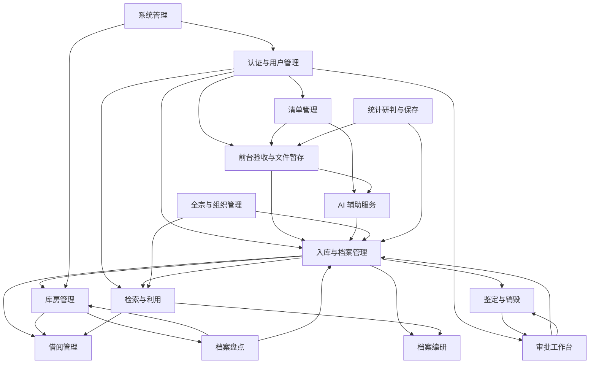

# 智能档案管理系统 — 模块说明

> 本文档面向开发人员，说明各模块的代码边界、依赖关系和前后端接口映射。阅读前应先了解 [业务场景](业务场景.md) 和 [技术架构](技术架构.md)。

---

## 1. 模块划分总览

| 编号 | 模块 | 后端人 | 前端人 | 后端分支 | 前端分支 | P |
|------|------|--------|--------|----------|----------|---|
| M01 | 认证与用户管理 | 周扬 | 胡颖/郭一坤 | `feat/base-zhou` | `feat/base-hu` `feat/base-guo` | P0 |
| M02 | 清单管理 | 周扬 | 郭一坤 | `feat/transfer-zhou` | `feat/portal-guo` | P0 |
| M03 | 前台验收与文件暂存 | 周扬/刘星 | 胡颖 | `feat/transfer-zhou` `feat/file-liu` | `feat/acceptance-hu` | P0 |
| M04 | AI 辅助服务 | 刘星 | 胡颖 | `feat/search-liu` | `feat/archive-hu` | P0 |
| M05 | 入库与档案管理 | 周扬 | 胡颖 | `feat/archive-zhou` | `feat/archive-hu` | P0 |
| M06 | 全宗与组织管理 | 周扬 | 胡颖 | `feat/archive-zhou` | `feat/archive-hu` | P1 |
| M07 | 库房管理 | 周扬 | 郭一坤 | `feat/storage-zhou` | `feat/storage-guo` | P1 |
| M08 | 检索与利用 | 刘星 | 郭一坤 | `feat/search-liu` | `feat/search-guo` `feat/portal-guo` | P0 |
| M09 | 借阅管理 | 刘星 | 郭一坤 | `feat/borrow-liu` | `feat/storage-guo` | P0 |
| M10 | 审批工作台 | 周扬/刘星 | 胡颖 | `feat/appraisal-zhou` `feat/borrow-liu` | `feat/appraisal-hu` | P1 |
| M11 | 鉴定与销毁 | 周扬 | 胡颖 | `feat/appraisal-zhou` | `feat/appraisal-hu` | P1 |
| M12 | 档案盘点 | 刘星 | 郭一坤 | `feat/stats-liu` | `feat/storage-guo` | P1 |
| M13 | 档案编研 | 刘星 | 郭一坤 | `feat/stats-liu` | `feat/stats-guo` | P2 |
| M14 | 统计研判与保存 | 刘星 | 胡颖/郭一坤 | `feat/stats-liu` | `feat/settings-hu` `feat/stats-guo` | P2 |
| M15 | 系统管理 | 周扬 | 胡颖 | `feat/appraisal-zhou` | `feat/settings-hu` | P1 |

**表1-1 模块划分总览表**

> P0 = 核心闭环，必须完整实现。P1 = 主流程完整，复杂边界可降级。P2 = 基础可用，延期则保留入口。

---

## 2. 模块依赖关系



**图2-1 模块依赖关系图**

> 箭头方向：A → B 表示 "B 依赖 A"（B 调用 A 的接口或读取 A 的数据）。

---

## 3. 各模块详细说明

### 3.1 M01 认证与用户管理

**职责：** 统一身份认证、角色权限校验、公众注册、Token 签发与验证。所有业务接口的后端鉴权都依赖本模块提供的 `AuthContext`（当前用户、角色、最大密级、数据范围）。

**涉及表：**
`users` `roles` `user_roles` `organizations`

**后端文件：**
| 层 | 文件 |
|------|------|
| Controller | `AuthController` `UserController` |
| Service | `AuthService` `UserService` |
| Mapper | `UserMapper` `RoleMapper` `OrganizationMapper` |
| Config | `SaTokenConfig` `CorsConfig` |

**前端页面：**
| 页面 | 路由 | 前端人 |
|------|------|--------|
| 统一登录页 | `/login` | 郭一坤 |
| 公众注册 | `/public/register` | 郭一坤 |
| 用户管理 | `/admin/users` | 胡颖 |
| 角色查看 | `/admin/roles` | 胡颖 |

**对外接口（后端）：**
- `AuthContext.getCurrentUser()` — 获取当前登录用户
- `AuthContext.getMaxSecurityLevel()` — 获取用户最大可查密级
- `AuthContext.getDataScope()` — 获取用户数据范围
- `SaTokenUtil.checkRole(roleCode)` — 角色校验

**依赖：** 无外部模块依赖。

**被依赖：** 所有其他模块。

---

### 3.2 M02 清单管理（移交 + 征集）

**职责：** 移交单位经办人在线编制移交清单，公众提交征集（捐赠）意向清单。清单只是预入库数据，不生成正式档号。支持导出 PDF。

**涉及表：**
`intake_batches` `intake_items` `business_attachments` `system_configs`

**后端文件：**
| 层 | 文件 |
|------|------|
| Controller | `TransferController` `CollectionController` |
| Service | `TransferService` `CollectionService` |
| Mapper | `IntakeBatchMapper` `IntakeItemMapper` |

**前端页面：**
| 页面 | 路由 | 前端人 |
|------|------|--------|
| 移交工作台 | `/transfer/dashboard` | 郭一坤 |
| 移交清单列表 | `/transfer/batches` | 郭一坤 |
| 创建/编辑移交清单 | `/transfer/batches/new` | 郭一坤 |
| 移交清单详情/导出 | `/transfer/batches/:id` | 郭一坤 |
| 征集清单（公众端） | `/public/collections` | 郭一坤 |

**关键状态流转：**
```
批次: draft → pending_transfer → pending_receive → received/partially_received → archived → shelved
条目: draft → pending_acceptance → accepted/rejected → pending_archive → archived
征集: draft → pending_contact → pending_receive/rejected → (同移交)
```

**对 M01 的依赖：** 用户认证、角色校验（`transfer_user` / `public_user`）。

**对 M03 暴露：** 前台验收需要读取清单批次和条目数据。

**对 M04 暴露：** AI 补全需要读取已接收条目的元数据。

---

### 3.3 M03 前台验收与文件暂存

**职责：** 前台管理员按照移交/征集清单逐项验收纸质原件和电子介质；上传电子文件到 MinIO 暂存路径；按文件名匹配清单条目；支持回退异常条目和导出接收回执。

**涉及表：**
`intake_batches` `intake_items` `staging_files` `file_check_records` `business_attachments`

**后端文件：**
| 层 | 文件 |
|------|------|
| Controller | `ReceptionController`（验收批次的读写）、`StagingFileController`（暂存文件 CRUD） |
| Service | `ReceptionService` `StagingFileService` `FileCheckService` |
| Mapper | `StagingFileMapper` `FileCheckRecordMapper` |
| Util | `HashUtil` `FileTypeUtil` |
| Config | `FileSecurityConfig` |

**前端页面：**
| 页面 | 路由 | 前端人 |
|------|------|--------|
| 待验收批次列表 | `/admin/reception` | 胡颖 |
| 验收详情（条目+文件匹配） | `/admin/reception/:batchId` | 胡颖 |
| 文件上传 | 验收详情页内嵌 | 胡颖 |
| 手工匹配文件 | 验收详情页内嵌 | 胡颖 |
| 导出接收回执 | 验收详情页按钮 | 胡颖 |

**关键状态流转（暂存文件）：**
```
未上传 → 暂存(staging) → 匹配成功(matched) / 匹配异常(unmatched) / 重复(duplicate)
matched → 已归档(archived)（入库时复制为正式文件）
```

**对 M01 的依赖：** 角色校验（`front_archivist`）。

**对 M02 的依赖：** 读取清单批次和条目，回写条目验收结果和批次状态。

**对 M05 暴露：** 后台入库时，已匹配暂存文件需要复制为正式 `archive_files`。

**关键约束：**
- 文件上传必须经过格式白名单、大小限制、SHA-256 哈希、MIME 识别、ClamAV 病毒扫描。
- ClamAV 不可用或命中病毒时拒绝上传，不创建可用文件记录。
- 回退电子文件条目时删除对应暂存对象。

---

### 3.4 M04 AI 辅助服务

**职责：** 封装 AI 调用、JSON 提取、白名单校验、重试和批处理任务管理。AI 不直接操作数据库，只返回候选字段或查询条件。

**适用入口（本期 4 个）：**
1. 接收清单补全（异步批处理）→ 输出 `title` `responsible` `formedDate` `category` `tags`
2. 内部检索（同步）→ 输出查询条件 JSON
3. 公众检索（同步）→ 输出查询条件 JSON
4. 数据研判（异步批处理）→ 输出异常候选和修正建议

**涉及表：**
`ai_tasks` `ai_task_batches`

**后端文件：**
| 层 | 文件 |
|------|------|
| Controller | `AiController` |
| Service | `AiSuggestionService`（AI 调用 + JSON 提取 + 白名单） `AiTaskService`（批处理拆分、重试） |
| Mapper | `AiTaskMapper` |
| Config | `AiModelConfig` |

**前端页面：**
| 页面 | 路由 | 前端人 |
|------|------|--------|
| AI 补全建议确认 | 入库详情页内嵌 | 胡颖 |
| AI 检索输入框 | 检索页顶部 | 郭一坤 |

**安全边界：**
- AI 只允许返回 `title` `responsible` `formedDate` `category` `tags`。
- 出现 `securityLevel` `retentionPeriod` `openStatus` `allowDigitization` `archiveNo` `warehouseLocation` `destructionStatus` 时必须剥离或拒绝。
- 检索类 AI 注入固定门类和用户可见标签，不注入档案题名或正文。
- AI 不可用时回退为手工填写/手工筛选，不阻塞核心业务。

**对 M01 的依赖：** 获取当前用户可见范围，用于限制 AI 提示词中的标签集合。

**对 M02/M05/M14 的依赖：** 接收业务数据、返回候选结果；不直接写业务表。

---

### 3.5 M05 入库与档案管理

**职责：** 后台管理员确认 AI 补全建议、生成正式档号、创建 `archives` 记录；将暂存文件复制为正式 `archive_files`；处理装盒上架预占；提供正式档案列表、详情、元数据编辑（仅非受保护字段）。

**涉及表：**
`archives` `archive_files` `archive_tags` `tags` `archive_change_logs` `categories` `archive_boxes` `archive_box_items` `storage_locations`

**后端文件：**
| 层 | 文件 |
|------|------|
| Controller | `PendingArchiveController`（待入库操作） `ArchiveController`（档案 CRUD） `ArchiveFileController`（文件预览/下载/删除） |
| Service | `ArchiveService` `ArchiveFileService` `CategoryService` |
| Mapper | `ArchiveMapper` `ArchiveFileMapper` `TagMapper` `ArchiveTagMapper` `ArchiveChangeLogMapper` |
| Util | `ArchiveNoUtil` |

**前端页面：**
| 页面 | 路由 | 前端人 |
|------|------|--------|
| 待入库批次列表 | `/admin/pending-archive` | 胡颖 |
| 入库详情（AI 建议确认） | `/admin/pending-archive/:batchId` | 胡颖 |
| 确认入库 | 入库详情页内嵌 | 胡颖 |
| 档案管理列表 | `/admin/archives` | 胡颖 |
| 档案详情抽屉 | `/admin/archives/:id` | 胡颖 |
| 编辑元数据 | 详情抽屉内嵌 | 胡颖 |

**关键状态流转：**
```
条目: accepted → pending_archive → archived（确认入库后）
档案: pending_shelf（纸质相关）→ normal（上架确认后）
       normal（纯电子，入库即 normal）
```

**档号生成规则：**
- 由 `ArchiveNoUtil` 在入库时统一生成。
- 格式示例：`ARC-000001`，按固定前缀 + 自增序号。
- 清单提交和验收阶段不生成档号。

**受保护字段（普通编辑和 AI 不得直接修改）：**
`securityLevel` `retentionPeriod` `openStatus` `allowDigitization` `archiveNo` `warehouseLocation` `destructionStatus`

**对 M01 的依赖：** 角色校验（`back_archivist`）。

**对 M03 的依赖：** 读取暂存文件，入库时复制为正式文件。

**对 M04 的依赖：** 读取 AI 补全候选字段。

**对 M06 的依赖：** 入库时需指定全宗、组织。

**对 M07 的依赖：** 入库时需指定盒号和架位（纸质相关档案）。

**对 M08 暴露：** 检索模块读取正式档案数据。

**对 M09 暴露：** 借阅模块读取档案可借状态。

**对 M11 暴露：** 鉴定模块筛选到期档案。

---

### 3.6 M06 全宗与组织管理

**职责：** 维护全宗信息（全宗号、名称、所属单位）和组织信息（移交单位、立档单位）。全宗和组织是权限过滤和数据归属的基础。

**涉及表：**
`fonds` `organizations`

**后端文件：**
| 层 | 文件 |
|------|------|
| Controller | `FondsController` `OrganizationController` |
| Service | `FondsService` `OrganizationService` |
| Mapper | `FondsMapper` `OrganizationMapper` |

**前端页面：**
| 页面 | 路由 | 前端人 |
|------|------|--------|
| 全宗管理 | `/admin/fonds` | 胡颖 |
| 组织管理 | `/admin/organizations` | 胡颖 |

**对 M01 的依赖：** 角色校验（`back_archivist` / `sys_admin`）。

**被依赖：** M05（入库归属）、M08（检索过滤）。

---

### 3.7 M07 库房管理

**职责：** 管理库房、架位和档案盒。架位按「库房号-机架号-层号-盒位号」编码。支持档案盒移动和架位占用率告警。

**涉及表：**
`warehouse_rooms` `storage_locations` `archive_boxes` `archive_box_items`

**后端文件：**
| 层 | 文件 |
|------|------|
| Controller | `WarehouseController` |
| Service | `WarehouseService` |
| Mapper | `WarehouseRoomMapper` `StorageLocationMapper` `ArchiveBoxMapper` `ArchiveBoxItemMapper` |

**前端页面：**
| 页面 | 路由 | 前端人 |
|------|------|--------|
| 库房列表 | `/admin/warehouse/rooms` | 郭一坤 |
| 架位管理 | `/admin/warehouse/rooms/:roomId/locations` | 郭一坤 |
| 档案盒管理 | `/admin/warehouse/boxes` | 郭一坤 |
| 档案盒详情 | `/admin/warehouse/boxes/:boxId` | 郭一坤 |

**关键约束：**
- 新建库房时按 `rackCount × layersPerRack × boxesPerLayer` 自动生成架位。
- 架位占用率 ≥ 85% 触发告警。
- 已占用架位不得直接停用。
- 纸质+电子和纯纸质档案入库时必须指定盒号和架位并预占。
- 纯电子档案不占用架位。

**对 M01 的依赖：** 角色校验（`back_archivist`）。

**对 M05 的依赖：** 入库时预占架位，档案盒内条目与档案关联。

**对 M12 暴露：** 盘点模块读取架位信息，核对实物位置。

---

### 3.8 M08 检索与利用

**职责：** 提供内部查阅者和公众的档案检索；AI 自然语言生成查询条件；电子文件在线预览和下载；访问日志记录。

**涉及表：**
`archives` `archive_files` `archive_access_logs`

**后端文件：**
| 层 | 文件 |
|------|------|
| Controller | `SearchController`（内部检索） `PublicSearchController`（公开检索） |
| Service | `SearchService` |
| Mapper | `ArchiveMapper` `ArchiveAccessLogMapper` |

**前端页面：**
| 页面 | 路由 | 前端人 |
|------|------|--------|
| 内部工作台 | `/internal/dashboard` | 郭一坤 |
| 内部档案检索 | `/internal/search` | 郭一坤 |
| 内部档案详情 | `/internal/archives/:id` | 郭一坤 |
| 公众首页 | `/public/home` | 郭一坤 |
| 公开档案检索 | `/public/search` | 郭一坤 |
| 公开档案详情 | `/public/archives/:id` | 郭一坤 |

**权限过滤规则：**

| 端 | 硬过滤条件 |
|------|------------|
| 公众（未登录） | `securityLevel=0 AND openStatus=open AND lifecycleStatus=normal` |
| 公众（已登录） | 同上，额外可下载 |
| 内部查阅者 | `lifecycleStatus=normal`，按 `maxSecurityLevel` `dataScope` `organizationId/fondsId` 过滤 |

**关键约束：**
- 内部查阅者不显示具体库房架位，只显示是否可申请借阅。
- 文件预览和下载必须复用档案查询鉴权，通过后生成 MinIO 临时访问地址。
- 下载操作写入 `archive_access_logs`。

**对 M01 的依赖：** 用户鉴权、密级上限、数据范围。

**对 M04 的依赖：** AI 检索条件生成。

**对 M05 的依赖：** 读取正式档案数据。

---

### 3.9 M09 借阅管理

**职责：** 内部查阅者提交纸质档案借阅申请；后台管理员审批；前台管理员核验凭证并确认出库；归还记录和实体状态更新。

**涉及表：**
`borrow_requests` `archives` `business_attachments`

**后端文件：**
| 层 | 文件 |
|------|------|
| Controller | `BorrowController` |
| Service | `BorrowService` |
| Mapper | `BorrowRequestMapper` `ArchiveMapper` |

**前端页面：**
| 页面 | 路由 | 前端人 |
|------|------|--------|
| 我的借阅申请 | `/internal/borrow-requests` | 郭一坤 |
| 提交借阅申请 | `/internal/archives/:id` 内嵌 | 郭一坤 |
| 借阅审批列表 | `/admin/borrow-requests` | 郭一坤 |
| 出库确认 | 审批详情页按钮 | 郭一坤 |
| 归还确认 | 审批详情页按钮 | 郭一坤 |

**关键状态流转：**
```
applied → approved → voucher_issued → checked_out → returned / abnormal_return
拒绝: applied → rejected
```

**关键约束：**
- 只能借阅 `paper_electronic` 或 `paper` 档案。
- 档案必须 `lifecycleStatus=normal`、`loanStatus=available`、`conditionStatus=normal`。
- 命中运行中盘点任务的档案暂停借阅。
- 审批通过后可导出借阅凭证，凭证不等于出库记录。
- 前台核验凭证并点击确认出库后，档案才算实际借出。
- 异常归还是借阅记录终态，后续借阅由档案实体状态拦截。

**对 M01 的依赖：** 用户鉴权（申请方 `internal_reader`，审批方 `back_archivist`）。

**对 M05 的依赖：** 读取档案借阅状态，出库/归还时更新档案状态。

**对 M07 的依赖：** 审批时查看盒号和架位信息。

**对 M10 的依赖：** 不直接依赖审批工作台；借阅审批是独立流程。

---

### 3.10 M10 审批工作台

**职责：** 馆领导统一审批密级调整、开放调整和销毁清册。必须校验凭证档号存在、未销毁且与目标档案来源关系匹配。调整前后值和审批意见永久保留。

**涉及表：**
`approval_requests` `archives` `archive_change_logs` `destruction_lists`

**后端文件：**
| 层 | 文件 |
|------|------|
| Controller | `ApprovalController` |
| Service | `ApprovalService` |
| Mapper | `ApprovalRequestMapper` `ArchiveMapper` `DestructionListMapper` |

**前端页面：**
| 页面 | 路由 | 前端人 |
|------|------|--------|
| 审批工作台列表 | `/admin/approvals` | 胡颖 |
| 审批详情（含目标/凭证档案） | `/admin/approvals/:id` | 胡颖 |
| 审批通过/退回 | 审批详情页按钮 | 胡颖 |

**审批类型与生效规则：**

| 类型 | 发起人 | 审批通过后变更 |
|------|--------|----------------|
| 密级调整 | 后台管理员 | 更新 `archives.securityLevel` |
| 开放调整 | 后台管理员 | 更新 `archives.openStatus` |
| 销毁审批 | 后台管理员 | 清册 `pending_approval → pending_destroy` |

**关键约束：**
- 凭证档案必须已入库且未销毁。
- 解密不等于自动公开，解密后如需公开仍需走开放调整流程。
- 同一档案同类审批只能有一个 `pending`。
- 审批退回时目标字段不变。

**对 M01 的依赖：** 角色校验（发起方 `back_archivist`，审批方 `director`）。

**对 M05 的依赖：** 密级/开放调整最终写入 `archives` 表；获取目标档案和凭证档案。

**对 M11 的依赖：** 销毁审批依赖于鉴定模块生成的销毁清册。

---

### 3.11 M11 鉴定与销毁

**职责：** 对保管期限即将到期的档案创建鉴定批次；逐件给出延长保存或待销毁结论；待销毁档案自动生成销毁清册（含元数据快照）；提交馆领导审批；确认销毁后档案状态不可恢复。

**涉及表：**
`appraisal_batches` `appraisal_items` `destruction_lists` `destruction_items` `archives` `archive_files` `archive_boxes` `archive_box_items`

**后端文件：**
| 层 | 文件 |
|------|------|
| Controller | `AppraisalController` `DestructionController` |
| Service | `AppraisalService` `DestructionService` |
| Mapper | `AppraisalBatchMapper` `AppraisalItemMapper` `DestructionListMapper` `DestructionItemMapper` |

**前端页面：**
| 页面 | 路由 | 前端人 |
|------|------|--------|
| 鉴定批次列表 | `/admin/appraisal` | 胡颖 |
| 鉴定批次详情 | `/admin/appraisal/:batchId` | 胡颖 |
| 销毁清册列表 | `/admin/destruction` | 胡颖 |
| 销毁清册详情 | `/admin/destruction/:listId` | 胡颖 |
| 确认销毁 | 清册详情页按钮 | 胡颖 |

**关键状态流转：**
```
鉴定批次: draft → completed
档案: normal → pending_destruction → destroyed
销毁清册: draft → pending_approval → pending_destroy → destroyed
```

**关键约束：**
- 系统提前提醒保管期限即将到期的档案。
- 销毁清册生成时固定档案元数据快照。
- 确认销毁时必须填写销毁时间、销毁方式、两名监销人，并上传现场照片。
- 档案元数据、审批记录、销毁清册、操作日志永久保留，仅标记 `destroyed` 状态。

**对 M01 的依赖：** 角色校验（`back_archivist`）。

**对 M05 的依赖：** 按保管期限、分类、年度、全宗筛选档案。

**对 M10 的依赖：** 提交销毁审批，由馆领导在审批工作台处理。

---

### 3.12 M12 档案盘点

**职责：** 按库房和分类创建盘点任务；系统生成应盘明细；管理员逐项核对实物位置和状态；生成差异报告。

**涉及表：**
`inventory_tasks` `inventory_items` `archives` `archive_boxes` `storage_locations`

**后端文件：**
| 层 | 文件 |
|------|------|
| Controller | `InventoryController` |
| Service | `InventoryService` |
| Mapper | `InventoryTaskMapper` `InventoryItemMapper` |

**前端页面：**
| 页面 | 路由 | 前端人 |
|------|------|--------|
| 盘点任务列表 | `/admin/inventory` | 郭一坤 |
| 盘点任务详情 | `/admin/inventory/:taskId` | 郭一坤 |
| 盘点明细核对 | 详情页内嵌 | 郭一坤 |

**关键状态流转：**
```
任务: draft → running → completed
盘点结果: normal / missing / misplaced / damaged
```

**关键约束：**
- 盘点范围为 `roomId + categoryId`。
- 盘点期间命中范围的档案暂停借阅审批。
- 已借出档案在盘点清单中标记为「借出中」。

**对 M01 的依赖：** 角色校验（`back_archivist`）。

**对 M05 的依赖：** 获取档案实体状态。

**对 M07 的依赖：** 获取架位信息。

---

### 3.13 M13 档案编研

**职责：** 后台管理员选择素材档案、撰写编研正文（富文本）、生成 PDF/HTML 附件、将编研成果作为纯电子档案入库。

**涉及表：**
`compilations` `compilation_materials` `archives` `archive_files`

**后端文件：**
| 层 | 文件 |
|------|------|
| Controller | `CompilationController` |
| Service | `CompilationService` |
| Mapper | `CompilationMapper` `CompilationMaterialMapper` |

**前端页面：**
| 页面 | 路由 | 前端人 |
|------|------|--------|
| 编研成果列表 | `/admin/compilations` | 郭一坤 |
| 创建/编辑编研 | `/admin/compilations/new` | 郭一坤 |
| 编研详情 | `/admin/compilations/:id` | 郭一坤 |

**关键约束：**
- 素材档案必须存在、未销毁且管理员有权查看。
- 只记录素材引用关系，不复制素材正文。
- 编研成果入库后正文转为正式 `archive_files`，`sourceType=compilation`。

**对 M01 的依赖：** 角色校验（`back_archivist`）。

**对 M05 的依赖：** 素材引用写入 `archives`；成果入库生成正式档案。

**对 M08 的依赖：** 通过检索找到合适的素材档案。

---

### 3.14 M14 统计研判与保存

**职责：** 提供馆藏总览、分类分布、年度趋势等统计图表；对元数据缺失、分类一致性、载体一致性进行数据研判（AI 辅助）；管理数据库和文件备份任务；记录四性检测结果。

**涉及表：**
`analysis_tasks` `analysis_items` `backup_tasks` `file_check_records` `archives`（只读统计）

**后端文件：**
| 层 | 文件 |
|------|------|
| Controller | `StatisticsController` `AnalysisController` `BackupController` |
| Service | `StatisticsService` `AnalysisService` `BackupService` |
| Mapper | `AnalysisTaskMapper` `AnalysisItemMapper` `BackupTaskMapper` `FileCheckRecordMapper` |

**前端页面：**
| 页面 | 路由 | 前端人 |
|------|------|--------|
| 数据统计 | `/admin/statistics` | 郭一坤 |
| 研判任务列表 | `/admin/analysis` | 郭一坤 |
| 研判任务详情 | `/admin/analysis/:taskId` | 郭一坤 |
| 备份管理 | `/admin/backup` | 胡颖 |
| 四性检测记录 | `/admin/file-checks` | 胡颖 |

**关键约束：**
- 统计数据从业务表实时汇总，不单独维护统计事实表。
- 数据研判需要 AI 时默认每批 50 条拆分。
- AI 只生成异常候选和修正建议，不自动修改正式档案。
- 备份支持立即备份和定时备份。
- 真实性校验依赖外部数字签名体系，无外部体系时记录 `not_configured`。

**对 M01 的依赖：** 角色校验（`back_archivist` / `sys_admin`）。

**对 M05 的依赖：** 从正式档案表读取统计数据。

**对 M03 的依赖：** 四性检测需要读取暂存/正式文件记录和哈希。

---

### 3.15 M15 系统管理

**职责：** 系统配置管理（文件格式白名单、上传大小限制、AI 功能开关、架位告警阈值等）；审计日志和档案访问日志查询与导出。

**涉及表：**
`system_configs` `audit_logs` `archive_access_logs`

**后端文件：**
| 层 | 文件 |
|------|------|
| Controller | `ConfigController` `AuditLogController` |
| Service | `ConfigService` `AuditService` |
| Mapper | `SystemConfigMapper` `AuditLogMapper` `ArchiveAccessLogMapper` |

**前端页面：**
| 页面 | 路由 | 前端人 |
|------|------|--------|
| 系统配置 | `/admin/settings` | 胡颖 |
| 审计日志 | `/admin/audit-logs` | 胡颖 |
| 访问日志 | `/admin/access-logs` | 胡颖 |

**关键约束：**
- `editable=false` 的配置项只读展示。
- 上传大小、白名单、AI 开关、公开检索开关变更写入审计日志。
- 审计日志不支持页面删除或修改。
- 系统管理员默认不授予档案正文查看权限。

**对 M01 的依赖：** 角色校验（`sys_admin`）。

---

## 4. 共享约定

### 4.1 档号生成

- **唯一生成点：** `ArchiveService.confirmArchive(itemId)`，位于 M05 入库模块。
- **生成工具：** `ArchiveNoUtil`，格式 `ARC-{自增序号}`。
- **其他模块的规则：** M02（清单）、M03（验收）不得生成档号。M11（销毁）、M09（借阅）、M13（编研）只读取档号。

### 4.2 状态机变更权限

| 状态对象 | 可变更模块 |
|----------|------------|
| 清单批次/条目状态 | M02（提交）、M03（验收） |
| 暂存文件状态 | M03（上传、匹配） |
| 正式档案生命周期 | M05（入库、上架）、M11（鉴定→待销毁、销毁） |
| 借阅状态 | M09（申请、审批、出库、归还） |
| 审批单状态 | M10（通过、退回）、M11（提交销毁审批） |
| 盘点任务状态 | M12（创建、开始、完成） |

### 4.3 编号规范

| 编号类型 | 生成位置 | 格式 |
|----------|----------|------|
| 档号 `archiveNo` | M05 `ArchiveNoUtil` | `ARC-{6位序号}` |
| 清单号 `batchNo` | M02 提交时 | `TFR-{日期}-{序号}` / `COL-{日期}-{序号}` |
| 借阅凭证号 `voucherNo` | M09 首次导出凭证时 | `VCH-{6位序号}` |
| 销毁清册号 | M11 生成时 | `DES-{日期}-{序号}` |
| 架位编码 | M07 创建库房时 | `{roomNo}-{rackNo}-{layerNo}-{boxSlotNo}` |

### 4.4 跨模块事务边界

- **M03 → M05：** 暂存文件复制为正式文件采用可补偿口径：先创建 `archive_files` 记录再复制 MinIO 对象，失败时保留 `failed` 状态并允许后台重试。
- **M11 → M10：** 销毁审批和确认销毁分两步，中间通过 `pending_destroy` 状态衔接。
- **M09：** 借阅审批、出库、归还各为独立事务，通过状态字段衔接。
- **M05：** 入库操作在一个事务内完成：生成 `archives` + 复制 `archive_files` + 创建 `archive_box_items` + 预占架位。

### 4.5 审计日志写入点

以下操作必须写入 `audit_logs`：
- 登录、登出、注册
- 清单提交、验收、回退
- 文件上传、删除
- 入库、上架、元数据编辑
- 审批提交、通过、退回
- 借阅申请、审批、出库、归还
- 鉴定完成、销毁清册提交、确认销毁
- 用户创建、禁用、密码重置
- 系统配置修改

所有模块的 Service 层统一调用 `AuditService.log(moduleName, operationType, businessType, businessId, detail)`。

---

## 5. 文档对照索引

| 需求条目 | 对应模块 | 接口文档章节 | 数据库表 | 业务场景 |
|----------|----------|-------------|----------|----------|
| 用户登录、注册、权限 | M01 | 第 2-3 章、第 22 章 | users, roles, user_roles | 场景十四 |
| 移交清单编制 | M02 | 第 4 章 | intake_batches, intake_items | 场景一 |
| 社会征集 | M02 | 第 5 章 | intake_batches, intake_items | 场景二 |
| 前台验收、文件上传 | M03 | 第 7-8 章 | intake_items, staging_files | 场景一、二 |
| AI 补全、检索 | M04 | 第 5.6, 9.3, 11.4 节 | ai_tasks, ai_task_batches | 场景一、九、十二 |
| 入库、档案管理 | M05 | 第 9-10 章 | archives, archive_files, tags | 场景三 |
| 全宗、组织管理 | M06 | 第 17 章 | fonds, organizations | 场景十八 |
| 库房、架位、档案盒 | M07 | 第 16 章 | warehouse_rooms, storage_locations, archive_boxes | 场景六 |
| 检索、预览、下载 | M08 | 第 5, 11 章 | archives, archive_files, archive_access_logs | 场景九、十一 |
| 借阅申请、审批、出库归还 | M09 | 第 11-12 章 | borrow_requests, archives | 场景八 |
| 密级/开放调整审批 | M10 | 第 10, 13 章 | approval_requests, archive_change_logs | 场景三 |
| 鉴定、销毁 | M11 | 第 14-15 章 | appraisal_batches, destruction_lists | 场景四、五 |
| 盘点 | M12 | 第 18 章 | inventory_tasks, inventory_items | 场景七 |
| 编研 | M13 | 第 19 章 | compilations, compilation_materials | 场景十 |
| 统计、研判、备份、四性 | M14 | 第 20-21 章 | analysis_tasks, backup_tasks, file_check_records | 场景十二、十三 |
| 系统配置、日志审计 | M15 | 第 22-23 章 | system_configs, audit_logs | 场景十四 |

**表5-1 文档对照索引**
