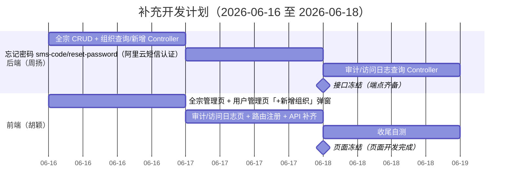

# 智能档案管理系统补充开发计划

项目名称：智能档案管理系统

委托单位：克拉玛依市档案馆

承担单位：方江苏项目组

编写人：方江苏

编写日期：2026年06月15日

---

## 1. 背景与范围

本计划是 [doc/项目计划.md](项目计划.md) 的增补，补做原计划遗漏的 4 块开发任务：忘记密码（后端）、全宗管理、组织维护、日志审计。设计文档里这几块都有完整规格，但原计划没排开发任务。开发窗口 **2026-06-16 至 06-18**。

> **范围声明**：本计划只覆盖「补开发」（把缺失的前后端代码补出来）。**联调（后端调通所有接口、前端接入接口并调试前端）另行成文，不在本计划范围内。**

### 1.1 要补的模块

以下模块在**设计文档中均有完整规格**，但原计划未排开发任务，需要补做：

| 模块 | 设计文档 | 原计划中的状态 |
|------|----------|----------------|
| ① 忘记密码（公众找回密码） | [接口文档 §3.5 / §3.6](接口文档.md)、`prototype/public/forgot-password.html` + 原型设计 + 验收 | 全文未点名，M01 仅写「公众注册」 |
| ② 全宗管理 | [接口文档 §17.1-17.3](接口文档.md)、[数据库设计 §4.2](数据库设计.md)、[业务场景 场景十八](业务场景.md)、`prototype/admin/fonds.html` + 原型设计 + 验收、[模块说明 M06](模块说明.md) | M06 归 `feat/archive-zhou` / `feat/archive-hu`，但分支任务描述只写「待入库、档案管理、上架」，未写全宗 |
| ② 附属：组织维护 | [接口文档 §17.4-17.6](接口文档.md)、[模块说明 M06](模块说明.md)；全宗原型设计 L49「组织单位缺失时跳转用户管理补齐」 | 仅点名「全宗」，从未点名「组织」；且原设计意图是并入用户管理，非独立页面 |
| ③ 日志审计（审计日志 + 档案访问日志） | [接口文档 §23.1 / §23.2](接口文档.md)、[业务场景 场景十四](业务场景.md)（L824/L832：查询+导出、不可删改）、[模块说明 M15](模块说明.md) | `feat/appraisal-zhou` 任务描述只写「鉴定、销毁、用户管理、系统配置」，未写日志审计 |

> 说明：组织维护**不做独立页面**——业务场景和 prototype 都没有独立设计，全宗原型设计 L49 的意图是「组织单位缺失时跳转用户管理补齐」。本计划只做「后端查询/新增端点 + 用户管理页『+新增组织』弹窗」。

### 1.2 现状对照（代码已核实）

| 模块 | 设计文档 | 前端 | 后端 | 主要缺口 |
|------|----------|------|------|----------|
| ① 忘记密码 | ✅ §3.5/§3.6 + 原型三件套 | ✅ 完整：路由 [public.ts:28-32](../frontend/src/router/routes/public.ts#L28)、页面 `views/public/forgot-password/index.vue`、API [auth.ts](../frontend/src/api/auth.ts)、mock + 单测齐全 | ❌ 无 `PublicAuthController`，无 sms-code / reset-password 端点 | 后端 2 个端点（接阿里云短信认证） |
| ② 全宗管理 | ✅ §17.1-17.3 + DB §4.2 + 场景十八 + `prototype/admin/fonds.html`(430 行) + 验收 | ⚠️ 路由已注册 [admin.ts:39,113](../frontend/src/router/routes/admin.ts#L39)，页面 `views/admin/fonds/index.vue` 仅 6 行「待实现」；API `fonds.ts` 仅只读 | ⚠️ 表 + `Fonds` 实体 + `FondsMapper` 已就绪（V1/V12/V13/V16），**无 Controller / Service / DTO** | 前端页面 + 后端 CRUD |
| ② 附属：组织维护 | ✅ §17.4-17.6 | ⚠️ API `organizations.ts` 仅查询；**无「新增组织」入口** | ⚠️ `Organization` 实体 + Mapper 已就绪（表 + 种子数据 V1/V16），**无 Controller** | 后端查询+新增端点；前端用户管理页「+新增组织」弹窗 |
| ③ 日志审计 | ✅ §23.1/§23.2 + 场景十四 + M15 | ❌ 仅概览页摘要展示，**无独立查询/导出页、无路由** | ⚠️ `AuditService`（只写）、`AuditLog` / `ArchiveAccessLog` 实体 + Mapper 已就绪，**无查询 Controller** | 前端 2 页 + 后端 2 个查询端点 |

## 2. 范围与优先级

| 优先级 | 模块 | 判定依据 |
|--------|------|----------|
| P1 | ② 全宗管理（含组织维护附属） | 入库主流程依赖（入库需指定全宗、全宗挂组织）；M06 标 P1；「清单到入库闭环」必涉 |
| P1 | ① 忘记密码（后端） | 前端已就绪、公众基本功能；公众注册与找回密码共用验证码机制 |
| P2 | ③ 日志审计 | 安全合规需求（场景十四）；审计数据各业务已在写入，仅缺查询展示；开发时间不足时可降级 |

## 3. 补充开发排期

补充开发窗口：**2026-06-16 至 06-18**（06-18 接口/页面冻结前）。本计划只覆盖开发任务，不含联调。冻结点判定标准在 [项目计划.md §5](项目计划.md) 里程碑基础上增加本计划模块。

### 3.1 甘特图



### 3.2 后端任务（负责人：周扬）

| 日期 | 任务 | 对应设计 | 验收点 |
|------|------|----------|--------|
| 06-16 | 全宗 CRUD：`FondsController` + `FondsService` + DTO（查询/新增/更新） | §17.1-17.3 | 全宗号唯一校验、有业务关联时只停用不物理删除、操作写审计日志 |
| 06-16 | 组织查询+新增：`OrganizationController`（GET 查询、POST 新增） | §17.4 / §17.5 | GET 供全宗/用户管理下拉；POST 供「+新增组织」弹窗；组织名称唯一（§17.6） |
| 06-17 | 公众找回密码：`PublicAuthController`（sms-code、reset-password） + 阿里云短信认证 SDK | §3.5 / §3.6 | 仅限公众账号找回；内部账号走 §22.6 重置；验证码校验由阿里云 `CheckSmsVerifyCode` 托管 |
| 06-18 | 日志查询：审计日志 Controller + 档案访问日志 Controller（分页/筛选/导出） | §23.1 / §23.2 | 不可删改；支持按操作类型、用户、时间筛选 |

### 3.3 前端任务（负责人：胡颖）

> 忘记密码（①）前端页面、API、Mock、单测均已就绪（郭一坤此前完成），**本计划无前端补充开发任务**；接入真实后端属联调阶段，另行安排。

| 日期 | 任务 | 对应设计 | 验收点 |
|------|------|----------|--------|
| 06-16 | 全宗管理页：列表/筛选/新建/编辑/详情/停用，还原 `prototype/admin/fonds.html` | §17.1-17.3 + 原型设计 | 全宗号创建后不可改、停用不影响历史查询 |
| 06-16 | 用户管理页「+新增组织」弹窗（所属单位下拉旁），符合全宗原型 L49 意图 | §17.5 + 原型 L49 | 弹窗调 POST `/api/admin/organizations`，新增后下拉刷新 |
| 06-16 | 补齐 `api/fonds.ts`（POST/PUT）、`api/organizations.ts`（POST） | §17.2 / §17.3 / §17.5 | 函数签名与后端端点对应 |
| 06-17 | 审计日志页 + 访问日志页 + 路由注册（`/admin/audit-logs`、`/admin/access-logs`） | §23.1/§23.2 + M15 L675-676 | 支持查询与导出，无删除入口 |
| 06-17 | 补齐 `api/audit-log.ts`、`api/access-log.ts` | §23 | 函数签名与后端端点对应 |
| 06-18 | 收尾自测：全宗、组织弹窗、审计/访问日志四组交互走通（Mock 数据） | — | 页面无报错、交互闭环 |

## 4. 分支与责任人

沿用 [项目计划.md §7.2](项目计划.md) 的 `feat/<模块>-<姓名>` 命名。从最新 `develop` 拉出新分支，完成后开 PR 合并回 `develop`。

| 模块 | 后端分支 / 责任人 | 前端分支 / 责任人 |
|------|-------------------|-------------------|
| ① 忘记密码 | `feat/forgot-password-zhou`（周扬） | —（前端已就绪，无需补充开发分支） |
| ② 全宗管理（含组织维护） | `feat/fonds-zhou`（周扬） | `feat/fonds-hu`（胡颖） |
| ③ 日志审计 | `feat/audit-log-zhou`（周扬） | `feat/audit-log-hu`（胡颖） |

## 5. 各模块补充任务明细

### 5.1 忘记密码（公众找回密码）

- **后端**：新增 `PublicAuthController`，实现 `POST /api/public/auth/sms-code`（§3.5，scene 支持 `register` / `forgot_password`）与 `POST /api/public/auth/reset-password`（§3.6）。校验规则按 §3.6 L278：仅允许公众账号通过此接口找回，内部账号由系统管理员经 §22.6 重置。
- **短信通道（阿里云「短信认证」，个人开发者方案）**：采用阿里云[号码认证服务/短信认证](https://help.aliyun.com/zh/pnvs/use-cases/sms-verify-for-individual-developers)（Dypnsapi），**不是**普通短信服务（Dysmsapi）——后者要求企业资质、个人开发者无法使用；前者**免资质、免签名/模板审核**，平台提供预置系统签名和标准验证码模板。接入：引入 `dypnsapi-20170525` Java SDK，`sms-code` 端点调 `SendSmsVerifyCode`（传 `phone_number` + 赠送 `sign_name` + 赠送 `template_code` + `template_param={"code":"##code##","min":"5"}`，由阿里云动态生成验证码）发码，`reset-password` 端点先调 `CheckSmsVerifyCode` 校验码再重置。**验证码的生成、存储、过期、一次性校验全部由阿里云侧托管，后端不存验证码、不需要 `sms_codes` 表、不改数据库设计。**
- **配置已就绪**：「短信认证」已开通，AK/SK + 100 条免费额度已就绪，并已在 [短信认证参数配置](https://dypns.console.aliyun.com/smsCertParamsConfig) 确认赠送签名与模板列表。忘记密码采用：赠送签名（5 选 1，推荐「**速通互联验证码**」）+ **重置密码模板 `100003`**（内容含 `${code}`、`${min}` 两变量）。签名 + 模板必须搭配（均系统赠送）。`application.yml` 示例：

  ```yaml
  aliyun:
    sms-auth:
      access-key-id: ${ALIYUN_SMS_ACCESS_KEY}
      access-key-secret: ${ALIYUN_SMS_SECRET}
      endpoint: dypnsapi.aliyuncs.com
      sign-name: 速通互联验证码
      template-code: "100003"
  ```

  发送（`SendSmsVerifyCode`）传 `templateParam={"code":"##code##","min":"5"}`、`codeType=1`（纯数字），验证码由阿里云生成；核验（`CheckSmsVerifyCode`）传手机号 + 验证码。放弃普通短信服务（Dysmsapi）自建模板（如 `SMS_335385381`，个人无资质无法发送）。
- **限制**：仅支持中国大陆手机号（国家码 86）。配置缺失时降级为固定验证码 + 日志输出（开发期 fallback）。
- **前端**：页面、API、Mock、单测均已就绪，无需补充开发；接入真实后端属联调阶段。

### 5.2 全宗管理（含组织维护附属）

- **后端·全宗**：`FondsController` + `FondsService` + 新增/更新 DTO，落地 §17.1-17.3。校验：全宗号唯一（对应迁移 `V13` 的 `uk_fonds_fonds_no`）；有档案或档案盒关联时只停用不物理删除（业务场景十八 L928-944）；操作写审计日志。
- **后端·组织维护**：`OrganizationController` 提供 GET（§17.4 查询，供全宗/用户管理下拉）与 POST（§17.5 新增，供弹窗补建组织）。组织名称唯一（§17.6）。**不做独立的组织管理页面与组织更新/删除接口**——组织作为基础字典，维护频率低，按全宗原型 L49 意图并入用户管理页。
- **前端·全宗页**：胡颖按 `prototype/admin/fonds.html`（430 行）与 `全宗管理-原型设计.md` 还原页面，替换现有 6 行占位；补 `api/fonds.ts` 的 POST/PUT。
- **前端·组织弹窗**：在用户管理页「所属单位」下拉旁加「+新增组织」弹窗（调 POST `/api/admin/organizations`，新增后下拉刷新），补 `api/organizations.ts` 的 POST。

### 5.3 日志审计

- **后端**：新增审计日志查询 Controller（§23.1 `GET /api/admin/audit-logs`）与档案访问日志查询 Controller（§23.2 `GET /api/admin/archive-access-logs`），支持分页、按操作类型/用户/时间筛选与导出。复用现有 `AuditLogMapper` / `ArchiveAccessLogMapper`。日志不可删改（M15 L681）。
- **前端**：胡颖新建 `views/admin/audit-logs/index.vue`、`views/admin/access-logs/index.vue` 并注册路由，提供查询与导出，无删除入口。
- **降级**：若 06-18 冻结前未完成，本模块（P2）可降级为「仅后端查询端点」，页面延后补。

## 6. 风险与降级策略

| 风险 | 影响 | 降级 / 应对 |
|------|------|-------------|
| 开发窗口仅 06-16~06-18 三天 | 时间紧 | ③ 日志审计（P2）可降级为仅后端端点，前端页面延后补 |
| 短信认证仅支持大陆手机号 | ① 忘记密码短信范围 | 采用阿里云「短信认证」（Dypnsapi）免资质方案，前提（AK/SK + 额度 + 已开通）已满足；仅中国大陆手机号可用，海外号不支持。配置缺失时固定码 + 日志 fallback |
| 公众注册后端尚未实现 | 与忘记密码共用验证码机制 | 本次不扩范围；后续补注册后端时复用 `PublicAuthController`（短信验证码由阿里云短信认证托管） |

## 7. 冻结点补充

[项目计划.md §5](项目计划.md) 的「2026-06-18 接口与页面冻结」里程碑，在原判定标准基础上增加：

- **接口冻结**：`/api/admin/fonds`（CRUD）、`/api/admin/organizations`（查询 + 新增）、`/api/public/auth/sms-code` + `reset-password`、`/api/admin/audit-logs` + `archive-access-logs` 端点齐备并可经 Swagger 访问。
- **页面冻结**：全宗管理、审计日志、访问日志三个页面开发完成并可独立操作；组织维护以用户管理页「+新增组织」弹窗形式提供（无独立页面）；忘记密码前端维持现状（接口接入与联调另行安排）。
