# 软件需求说明书

项目名称：智能档案管理系统

委托单位：克拉玛依市档案馆

承担单位：方江苏项目组

编写：方江苏 2026年06月09日

校对：周扬 2026年06月09日

审核：刘星 2026年06月09日

---

# 目 录

- [1. 引言](#1-引言)
  - [1.1 编写目的](#11-编写目的)
  - [1.2 项目背景](#12-项目背景)
  - [1.3 修订审批记录](#13-修订审批记录)
  - [1.4 参考资料](#14-参考资料)
- [2. 任务概述](#2-任务概述)
  - [2.1 建设目标](#21-建设目标)
  - [2.2 业务需求](#22-业务需求)
  - [2.3 用户特点](#23-用户特点)
  - [2.4 假设和约束](#24-假设和约束)
- [3. 需求分析](#3-需求分析)
  - [3.1 组织结构与系统用例](#31-组织结构与系统用例)
  - [3.2 数据流程与状态流转](#32-数据流程与状态流转)
  - [3.3 数据需求](#33-数据需求)
  - [3.4 功能需求](#34-功能需求)
  - [3.5 性能需求](#35-性能需求)
  - [3.6 安全保密需求](#36-安全保密需求)
  - [3.7 备份、灾备与四性检测](#37-备份灾备与四性检测)
  - [3.8 其它专门需求](#38-其它专门需求)
- [附录A：角色权限矩阵](#附录a角色权限矩阵)
- [附录B：业务场景与功能映射](#附录b业务场景与功能映射)
- [附录C：系统部署架构](#附录c系统部署架构)

---

# 1. 引言

## 1.1 编写目的

编写《软件需求说明书》的目的是使克拉玛依市档案馆与方江苏项目组对智能档案管理系统的建设范围、业务流程、功能需求、性能需求、安全要求和验收依据形成统一理解。本文件作为系统设计、编码实现、测试验证、部署上线和项目验收的需求基线。

本文档的作用包括：

1. 明确智能档案管理系统在档案接收、整理、保存、利用、鉴定、销毁、征集、库房、借阅、审批、统计和系统管理等方面的业务要求。
2. 明确新版业务场景中的关键口径：移交/征集清单是预入库数据，不等同于正式档案；电子文件由档案馆前台统一接收；AI 只提供字段建议、查询条件和研判候选，不直接操作数据库。
3. 明确用户、开发人员、测试人员、运维人员和验收人员共同遵循的功能边界和非功能指标。
4. 为后续概要设计、详细设计、数据库设计、接口设计、系统测试和项目验收提供可追溯依据。

本文档预期读者包括：项目委托方业务人员、档案馆管理人员、系统设计人员、开发工程师、测试工程师、系统管理员、运维人员和项目验收人员。

## 1.2 项目背景

随着《中华人民共和国档案法》和《中华人民共和国档案法实施条例》对档案信息化建设要求的进一步落实，各级档案馆需要通过信息化系统提升档案资源接收、保管、利用和开放服务能力。克拉玛依市档案馆作为本市档案行政管理和档案公共服务机构，承担全市机关、企事业单位档案接收、保管、利用、鉴定、开放和业务指导职责。

档案馆现有业务存在以下问题：

1. 移交、验收、入库、上架、借阅、鉴定和销毁等环节主要依赖人工台账，业务状态难以实时追踪。
2. 纸质原件、电子文件和扫描件缺少统一关联机制，纸电融合管理能力不足。
3. 移交单位提交清单、档案馆前台验收、后台入库之间缺少统一流程，回退和补正记录不够规范。
4. 档案检索依赖人工条件筛选，公众在线检索和下载开放档案的能力不足。
5. 密级调整、开放调整、销毁审批等重要事项缺少统一审批工作台和永久留痕机制。
6. 库房架位、盘点、纸质借阅、备份和四性检测缺少系统支撑。

为解决上述问题，本项目建设一套面向中小规模档案馆的智能档案管理系统，围绕档案馆日常工作场景，形成“线上清单 + 线下交接 + 前台验收 + 后台入库 + 纸电融合 + 权限利用 + 审批留痕”的业务闭环。

项目名称：智能档案管理系统

委托单位：克拉玛依市档案馆

承担单位：方江苏项目组

用户单位：克拉玛依市档案馆

项目投资估算：人民币44.35万元

## 1.3 修订审批记录

| 修订记录 | | | | |
|---------|---------|---------|---------|---------|
| **章节** | **修订日期** | **版本** | **修订描述** | **修订者** | **审核者** |
| 全部 | 2026-06-09 | V2.0 | 根据新版业务场景重写交付版 | 方江苏 | 周扬 |
| 全部 | 2026-06-09 | V2.1 | 补充图表引用、AI 边界和清单状态口径 | 方江苏 | 刘星 |

**表1 文档修订记录表**

| 审批记录 | | | | |
|---------|---------|---------|---------|---------|
| **审批方式** | **审批日期** | **版本** | **审批意见** | **提交者** | **审批者** |
| 会议评审 | 2026-06-09 | V2.1 | 审核通过，作为新版需求基线 | 方江苏 | 馆领导 |

**表2 文档审批记录表**

## 1.4 参考资料

| 文档名称 | 说明 |
|---------|------|
| 《中华人民共和国档案法》 | 档案管理工作的基本法律依据 |
| 《中华人民共和国档案法实施条例》 | 档案信息化建设和档案管理实施要求 |
| 《电子文件归档与电子档案管理规范》（GB/T 18894-2016） | 电子文件归档和电子档案管理标准 |
| 《档案著录规则》（DA/T 18-2022） | 档案元数据著录参考 |
| 《智能档案管理系统-产品定位》 | 产品定位、角色边界和核心原则 |
| 《智能档案管理系统-业务场景》 | 新版18个业务场景和流程规则 |
| 《智能档案管理系统-技术架构》 | 技术栈、部署、文件上传、AI 边界 |
| 《智能档案管理系统-AI交互架构》 | AI 输出格式、白名单、错误处理和页面落点 |
| 旧版《软件需求说明书-交付版》 | 旧版交付文档结构和基础内容 |

**表1-1 参考资料清单**

---

# 2. 任务概述

## 2.1 建设目标

本系统建设目标是为克拉玛依市档案馆构建一套覆盖档案收、管、存、用、鉴、毁全生命周期的智能档案管理平台。系统应实现以下目标：

1. **档案业务全流程线上化**：支持移交清单编制、前台验收、电子文件上传、后台入库、装盒上架、利用借阅、鉴定销毁、盘点、保存和统计等核心业务。
2. **纸电融合统一管理**：正式档案以档号为核心，统一关联纸质原件、电子文件、扫描件、盒号、架位和文件哈希，支持三类载体状态：纯电子、纸质+电子、纯纸质。
3. **清单与正式档案分离**：移交单位和公众提交的清单仅作为预入库数据和线下交接凭证，只有通过验收、补全和确认入库后才生成正式档案记录和档号。
4. **前台统一接收电子文件**：移交单位侧和公众侧拖拽文件只解析文件名、扩展名和大小，不上传文件本体；真实电子文件由前台管理员在到馆验收时统一上传。
5. **AI 辅助但不接管业务**：AI 支持元数据补全、自然语言检索条件生成和数据质量研判；所有结果必须经过白名单过滤和人工确认，不能覆盖密级、保管期限、是否公开等受保护字段。
6. **公众服务便捷化**：公众可检索公开、非密、未销毁档案，登录后可下载公开电子文件，并可提交无偿捐赠意向。
7. **安全合规可追溯**：所有关键操作、审批、下载、文件上传、销毁和字段调整均记录日志；密级和开放调整必须依托凭证档号和审批流程。

## 2.2 业务需求

本系统按照用户门户和业务领域划分功能。系统面向七类业务角色，支撑18个核心业务场景，覆盖档案馆实际运行中的主流程。

系统门户与功能模块如下图所示：

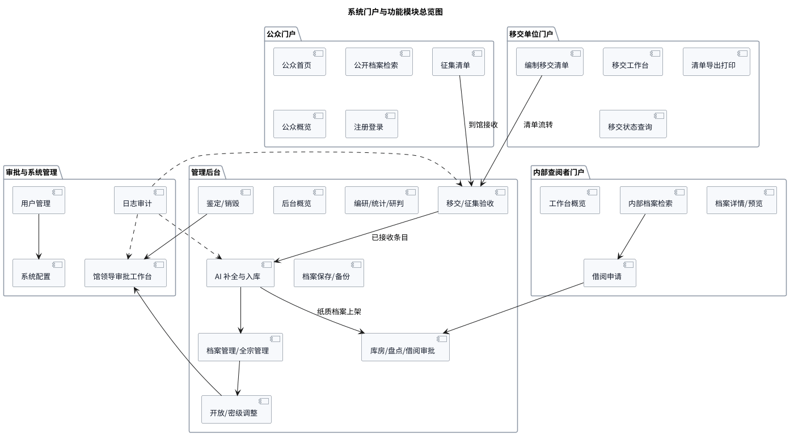

图2-1 系统门户与功能模块总览图

| 功能域 | 主要模块 | 说明 |
|--------|----------|------|
| 门户服务域 | 公众门户、内部查阅者门户、移交单位门户、管理后台 | 按用户角色提供不同入口和菜单 |
| 接收入库域 | 移交清单、征集清单、前台验收、电子文件上传、AI 补全、确认入库 | 实现清单到正式档案的转换 |
| 档案管理域 | 档案管理、档案整理、全宗管理、编研成果入库 | 维护正式档案资源 |
| 库房利用域 | 库房管理、架位管理、纸质借阅、出库归还、盘点 | 管理纸质原件和实物利用 |
| 鉴定处置域 | 档案鉴定、销毁清册、馆领导审批、监销确认 | 管理保管期限到期和销毁 |
| 安全开放域 | 密级调整、开放调整、凭证档号校验、统一审批 | 管理密级和公开状态变化 |
| 数据运行域 | 数据统计、数据研判、档案保存、备份、四性检测 | 支撑运行监测和数据质量治理 |
| 系统管理域 | 用户管理、角色权限、系统配置、日志审计 | 支撑系统运行和安全审计 |

**表2-1 功能域划分表**

## 2.3 用户特点

| 用户角色 | 代表 | 使用频率 | 主要关注点 |
|----------|------|----------|------------|
| 档案管理员（前台） | 小陈 | 每天 | 接待移交/捐赠、清点核对、上传电子文件、导出回执、借阅出库和归还 |
| 档案管理员（后台） | 小刘 | 每天 | AI 补全、正式入库、装盒上架、整理、库房、盘点、鉴定、销毁、统计研判 |
| 移交单位经办人 | 小张 | 每年1-2次 | 编制移交清单、导出打印、查看状态、线下交接 |
| 内部查阅者 | 小李 | 按需 | 检索档案、在线预览、下载权限内电子文件、申请借阅纸质原件 |
| 社会公众 | 小周 | 按需 | 检索公开档案、登录下载公开电子文件、提交捐赠意向 |
| 馆领导 | 小方 | 按需 | 审批销毁、密级调整、开放调整，查看审批依据和历史 |
| 系统管理员 | IT人员 | 偶尔 | 用户管理、系统配置、日志审计和备份参数 |

**表2-2 用户角色特点表**

说明：前台管理员和后台管理员是业务分工，小规模部署时可由同一账号承担。三员分立为可选增强模式，本期不强制实施。

## 2.4 假设和约束

1. 本系统服务一个档案馆实例，不作为跨馆统一平台建设。
2. 本期优先保证主流程闭环，复杂例外以异常状态和人工处理记录方式实现，不引入重型流程引擎。
3. 移交单位和公众端不上传正式电子文件；拖拽文件仅在浏览器端解析文件名、扩展名和大小，用于辅助清单填写。
4. 前台接收阶段上传的电子文件先进入 MinIO 暂存路径，后台确认入库并生成正式档号后再转入正式路径。
5. AI 输入仅限清单字段、文件名、元数据和用户自然语言；AI 不读取电子文件正文，不生成档号，不直接写库，不覆盖受保护字段。
6. 密级、保管期限、是否公开、是否允许数字化、档号、架位、销毁状态等为受保护字段，普通编辑和 AI 补全不得直接覆盖。
7. 系统采用 B/S 架构，前后端分离，后端为 Spring Boot 单体应用，部署方式为 Docker + docker-compose。
8. 数据库采用 PostgreSQL 17 推荐版本，最低支持 PostgreSQL 16；电子文件存储采用 MinIO；病毒扫描采用 ClamAV。
9. 系统数据迁移仅覆盖已整理的元数据和电子文件，历史纸质档案数字化工作可另行组织。

---

# 3. 需求分析

## 3.1 组织结构与系统用例

克拉玛依市档案馆的业务组织关系如下图所示：

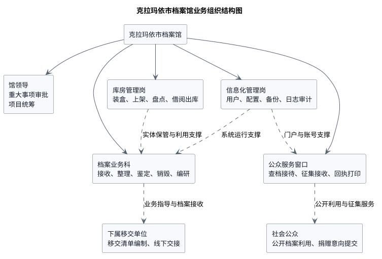

图3-1 克拉玛依市档案馆业务组织结构图

系统总体用例如下图所示：

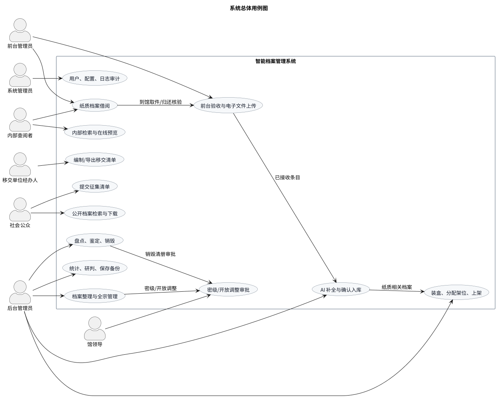

图3-2 系统总体用例图

系统用例围绕七类角色展开：

1. 移交单位经办人负责编制移交清单、导出打印清单、线下移交纸质原件和电子介质。
2. 社会公众负责检索公开档案、登录后下载公开电子文件、提交征集清单。
3. 前台管理员负责接收实物、上传电子文件、匹配清单条目、回退异常条目、导出回执。
4. 后台管理员负责 AI 补全、人工确认、正式入库、装盒上架、整理、库房、盘点、鉴定、销毁和统计研判。
5. 内部查阅者负责按权限检索、预览、下载和申请纸质借阅。
6. 馆领导负责密级调整、开放调整和销毁清册审批。
7. 系统管理员负责账号、角色、配置和日志管理。

## 3.2 数据流程与状态流转

系统总体数据流程如下图所示：

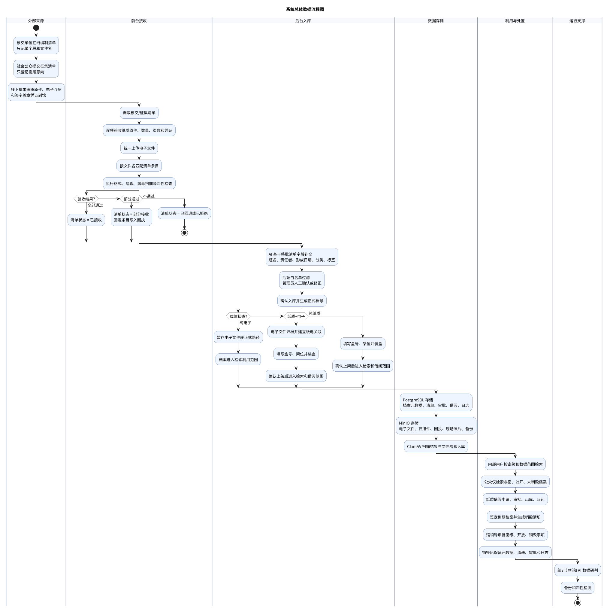

图3-3 系统总体数据流程图

系统中的关键数据对象包括移交/征集清单、清单条目、暂存电子文件、正式档案、纸质载体记录、正式电子文件记录、审批单、销毁清册和操作日志。清单与正式档案必须分离，禁止在清单提交时提前生成正式档号。

清单、文件与正式档案主状态机如下图所示：

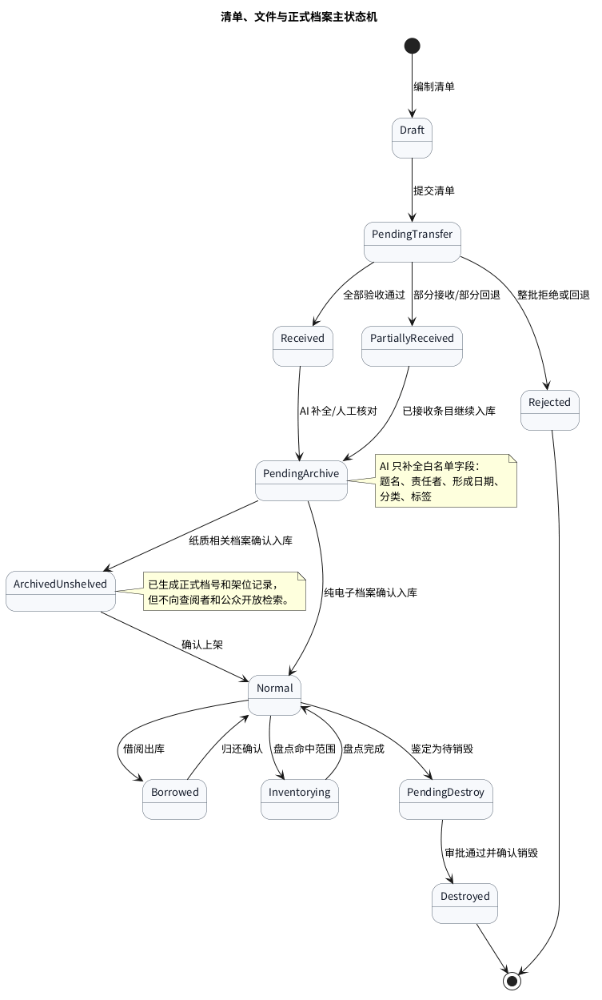

图3-4 清单、文件与正式档案主状态机

| 对象 | 典型状态 | 说明 |
|------|----------|------|
| 移交清单批次 | 草稿、待移交、已接收、部分接收、已入库、已上架、已回退 | 控制整批移交流程 |
| 征集清单批次 | 草稿、待联系、待接收、已接收、部分接收、已拒绝 | 控制捐赠意向到接收流程 |
| 清单条目 | 草稿、待验收、已接收、已回退、待入库、已入库 | 支持同一批次部分接收 |
| 暂存电子文件 | 未上传、暂存、匹配成功、匹配异常、已归档、已删除 | 文件状态独立于档案状态 |
| 正式档案 | 已入库未上架、正常、借出、待销毁、已销毁 | 正式档案生成后才出现；盘点暂停借阅由运行中的盘点任务动态判断 |
| 审批单/清册 | 待审批、已退回、已批准、待销毁、已销毁 | 密级、开放、销毁等审批使用 |

**表3-1 状态对象说明表**

## 3.3 数据需求

### 3.3.1 数据库与文件存储

系统采用 PostgreSQL 作为主数据库，存储档案元数据、清单、审批、借阅、库房、销毁、日志、用户权限和系统配置等结构化数据。数据库需使用 Flyway 管理版本化建表、索引、扩展和字典初始化。

电子文件、扫描件、回执、销毁现场照片、编研成果、备份文件等通过 MinIO 对象存储管理。文件访问必须通过后端鉴权后生成临时访问地址，不得直接暴露对象存储路径。

### 3.3.2 核心数据实体

| 实体 | 说明 | 关键字段 |
|------|------|----------|
| organizations | 单位组织 | 单位名称、单位类型、联系人、状态 |
| fonds | 全宗 | 全宗号、全宗名称、所属单位、说明、状态 |
| users | 统一用户 | 登录名、手机号、BCrypt 密码哈希、所属单位、最高可查密级、数据范围 |
| roles / user_roles | 预设角色与用户角色关系 | 角色编码、角色名称、用户ID、角色ID |
| categories | 固定档案门类 | 门类编码、门类名称、启用状态 |
| archives | 正式档案主表 | 档号、题名、责任者、形成日期、分类、密级、保管期限、开放状态、来源类型、载体状态、生命周期状态 |
| archive_files | 正式电子文件 | 档案ID、对象路径、MIME、扩展名、大小、SHA-256、扫描结果、文件状态 |
| tags / archive_tags | 标签字典与档案标签关系 | 标签名、档案ID、标签ID |
| archive_change_logs | 档案字段变更日志 | 档案ID、字段名、变更前后值、变更来源、操作人、时间 |
| intake_batches | 移交/征集清单批次 | 清单号、来源类型、状态、移交单位、捐赠人、约定时间、在线协议同意时间 |
| intake_items | 移交/征集清单条目 | 批次ID、条目序号、标题、文件名、载体状态、保管期限、密级、AI 建议、确认字段 |
| staging_files | 暂存电子文件 | 批次ID、条目ID、上传批号、原文件名、暂存路径、哈希、大小、扫描结果、匹配状态 |
| business_attachments | 业务附件 | 业务类型、业务ID、附件类型、对象路径、哈希、上传人 |
| warehouse_rooms | 库房 | 库房号、机架数量、层数、每层盒位数、容量、告警阈值 |
| storage_locations | 架位 | 库房ID、机架号、层号、盒位号、架位编码、占用状态 |
| archive_boxes / archive_box_items | 档案盒与盒内档案关系 | 盒号、架位、分类、全宗、盒内顺序、物理状态 |
| borrow_requests | 借阅申请 | 申请号、档案ID、申请人、审批状态、凭证号、出库时间、归还时间 |
| approval_requests | 统一审批单 | 审批类型、目标对象、凭证档案、调整前后值、审批人、意见 |
| appraisal_batches / appraisal_items | 鉴定批次与明细 | 鉴定批次号、范围、状态、鉴定结果、延长期限、意见 |
| destruction_lists / destruction_items | 销毁清册与明细快照 | 清册号、审批状态、销毁方式、档号快照、题名快照、密级快照 |
| inventory_tasks / inventory_items | 盘点任务与明细 | 任务号、库房、分类、状态、预期架位、实际架位、检查结果 |
| compilations / compilation_materials | 编研成果与素材引用 | 编研编号、标题、正文、状态、素材档案ID、引用说明 |
| analysis_tasks / analysis_items | 数据研判任务与建议 | 任务号、任务类型、规则快照、异常详情、建议、处理状态 |
| ai_tasks / ai_task_batches | AI 调用任务与批次 | 任务类型、业务对象、任务状态、批次状态、目标 ID、校验结果、错误信息 |
| backup_tasks | 备份任务 | 任务号、备份范围、状态、路径、大小、校验哈希 |
| file_check_records | 四性检测记录 | 检测对象、检测类型、检测结果、预期哈希、实际哈希、说明 |
| archive_access_logs | 查阅访问日志 | 用户、档案、文件、访问类型、IP、时间 |
| audit_logs | 操作审计日志 | 操作人、模块、操作类型、业务对象、详情、IP、时间 |
| system_configs | 系统配置 | 配置键、配置值、类型、说明、是否可编辑 |

**表3-2 核心数据实体表**

### 3.3.3 数据量估算

| 数据项 | 估算规模 |
|--------|----------|
| 档案条目 | 15-25万条，系统能力不低于25万条 |
| 年新增档案 | 约5000-8000件 |
| 年移交批次 | 约40-60批次 |
| 电子文件存储 | 不低于1TB |
| 下属移交单位 | 约30-50个 |
| 内部用户 | 约50人 |
| 公众用户 | 按需注册 |
| 操作日志 | 年均约10万条 |
| 并发用户 | 内部并发不低于20人，公众并发不低于50人 |

**表3-3 数据量估算表**

## 3.4 功能需求

### 3.4.1 系统角色

| 角色编号 | 系统角色 | 角色描述 |
|----------|----------|----------|
| R-01 | 前台管理员 | 负责现场接收、清点、电子文件上传、回执、借阅出库和归还 |
| R-02 | 后台管理员 | 负责正式入库、整理、库房、盘点、鉴定、销毁、统计、保存和研判 |
| R-03 | 移交单位经办人 | 负责编制移交清单、导出打印和查看移交状态 |
| R-04 | 内部查阅者 | 负责按权限检索档案、预览下载和申请纸质借阅 |
| R-05 | 社会公众 | 负责公开档案检索下载和捐赠意向提交 |
| R-06 | 馆领导 | 负责销毁、密级调整、开放调整等重大事项审批 |
| R-07 | 系统管理员 | 负责用户、权限、配置和日志 |

**表3-4 系统角色表**

### 3.4.2 移交清单与档案接收

业务部门移交与档案接收流程如下图所示：

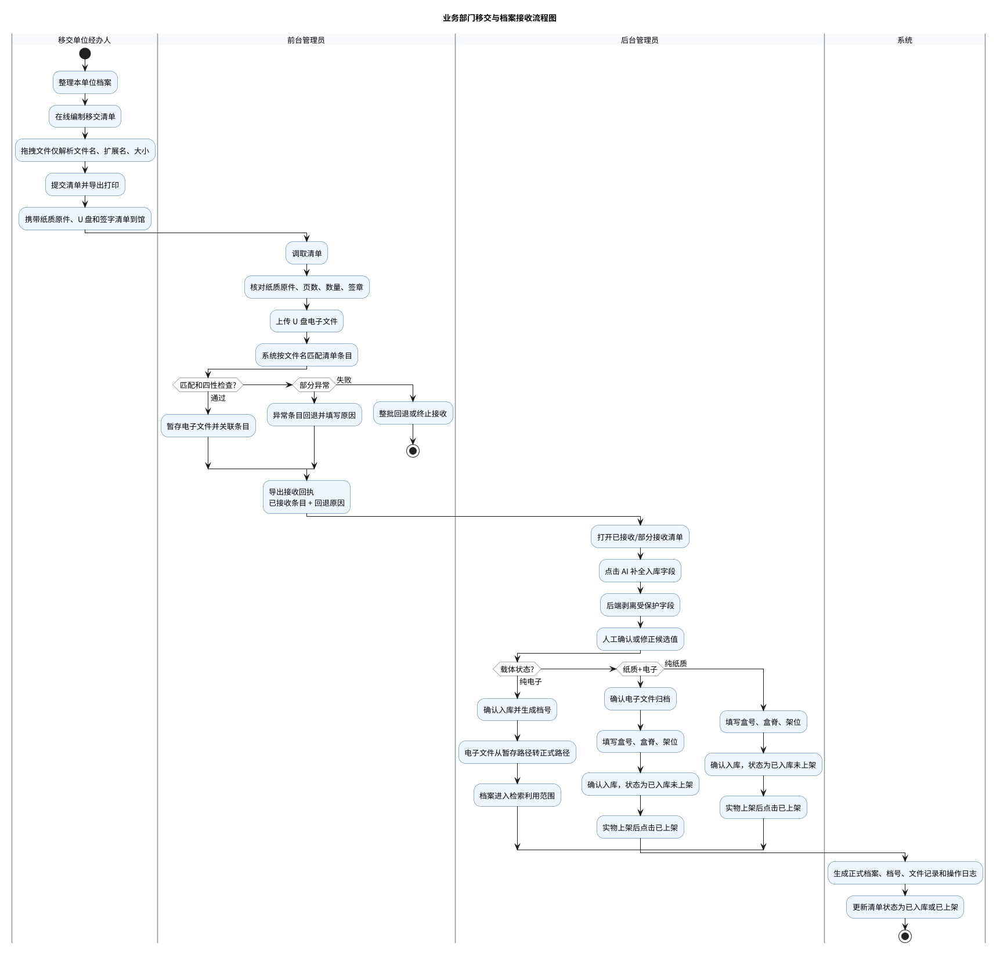

图3-5 业务部门移交与档案接收流程图

**功能说明：**

1. 移交单位经办人在线编制移交清单，填写清单级字段和条目字段。
2. 移交单位侧拖拽文件时仅解析文件名、扩展名和大小，不上传文件本体。
3. 清单提交后状态变为“待移交”，可导出 PDF 清单并线下签字盖章。
4. 前台管理员按清单逐项验收纸质原件和电子介质，上传电子文件，系统按文件名匹配条目。
5. 文件上传需校验格式、大小、SHA-256 哈希和 ClamAV 病毒扫描结果。
6. 异常条目可回退并填写原因；整批或部分验收后系统生成接收回执。
7. 后台管理员对已接收条目执行 AI 补全，AI 只补全题名、责任者、形成日期、分类、标签。
8. 后台管理员人工确认后正式入库，系统生成正式档号；纯电子档案入库后进入检索利用范围，纸质相关档案需上架后才进入检索和借阅范围。

**输入：**

- 移交清单、清单条目、线下签字清单
- 纸质原件、U 盘电子文件
- 文件匹配结果、验收结果、回退原因
- AI 补全候选字段、管理员确认字段
- 盒号、盒脊信息、架位信息

**输出：**

- 移交清单状态和条目状态
- 暂存文件记录和正式文件记录
- 正式档案记录和档号
- 接收回执、回退记录、操作日志
- 纸质载体记录、架位占用记录

### 3.4.3 社会征集与捐赠

社会征集与捐赠流程如下图所示：

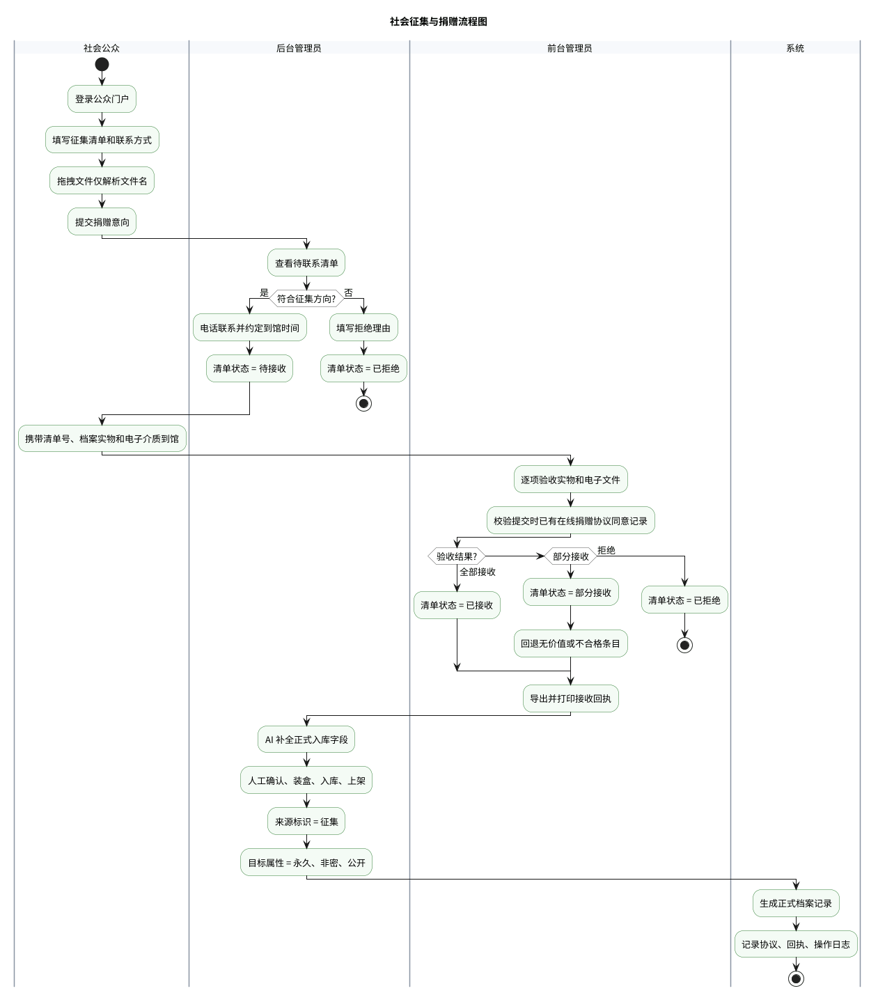

图3-6 社会征集与捐赠流程图

系统支持公众提交无偿捐赠意向。征集档案目标属性固定为永久保管、非密、公开，但公开利用必须在管理员检查、在线同意捐赠协议、正式入库之后生效。

功能要求：

1. 公众登录后可填写征集清单，拖拽电子文件仅解析文件名。
2. 后台管理员联系捐赠人，约定到馆时间，或填写拒绝理由。
3. 公众提交前必须在线勾选同意捐赠协议，系统记录同意时间；前台管理员到馆验收后导出接收回执。
4. 验收通过条目进入后台 AI 补全和正式入库流程。
5. 征集档案来源标识为“征集”，与移交档案区分。
6. 公众提交后的清单只读；被拒绝、部分接收和已接收清单保留结果和原因。

### 3.4.4 档案管理、整理与全宗管理

档案管理模块面向后台管理员，提供正式档案列表、分类筛选、详情抽屉、元数据编辑、密级调整入口、开放调整入口和文件预览入口。

功能要求：

1. 支持按题名、档号、责任者、形成日期、分类、全宗、密级、开放状态、载体状态筛选。
2. 支持五大固定分类：文书档案、科技档案、会计档案、音像档案、人事档案。
3. 支持编辑非受保护字段：题名、责任者、形成日期、分类、标签等。
4. 不得直接编辑密级、保管期限、是否公开、是否允许数字化、档号、架位、销毁状态等受保护字段。
5. 支持全宗建立、全宗号维护、立档单位信息维护、全宗指南编制和全宗内档案统计。
6. 支持题名模糊检索，使用 PostgreSQL `pg_trgm` 扩展和必要索引。

### 3.4.5 密级与开放调整审批

密级与开放调整审批流程如下图所示：

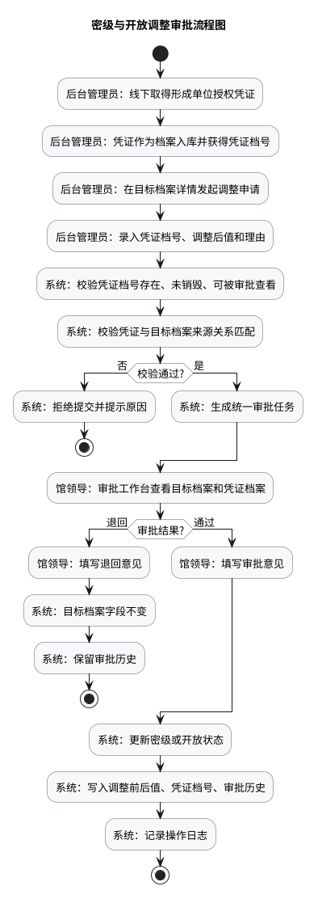

图3-7 密级与开放调整审批流程图

功能要求：

1. 密级调整和开放调整必须以凭证档号为依据。
2. 凭证档案需先作为正式档案入库，系统校验凭证档号存在、未销毁、可被当前审批查看，并校验凭证档案与目标档案来源关系匹配。
3. 馆领导审批时应同时查看目标档案和凭证档案。
4. 审批通过后字段生效；审批退回时目标档案字段不变。
5. 解密不等于自动公开，解密后如需公开仍需走开放调整流程。
6. 调整前后值、凭证档号、审批意见和操作日志必须永久保留。

### 3.4.6 库房管理与盘点

库房架位结构如下图所示：

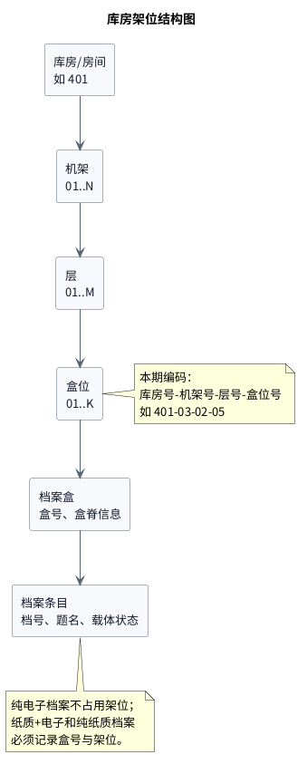

图3-8 库房架位结构图

功能要求：

1. 后台管理员可新建库房，配置库房号、机架数量、单机架层数、每层最大盒数。
2. 系统按“库房号-机架号-层号-盒位号”生成架位编码。
3. 纸质+电子和纯纸质档案入库时必须填写盒号和架位并预占架位，纯电子档案不占用架位；确认上架时只确认实物已放入预占架位。
4. 架位占用率达到85%时触发告警。
5. 支持按库房号和分类创建盘点任务，盘点范围为库房号 AND 分类。
6. 盘点期间命中范围的档案暂停审批借阅，但不直接修改档案主表借阅状态；已借出档案在盘点清单中标记为“借出中”。
7. 盘点结果支持正常、缺失、错位、损坏等状态，系统生成差异报告。

### 3.4.7 档案检索与纸质借阅

纸质档案借阅流程如下图所示：

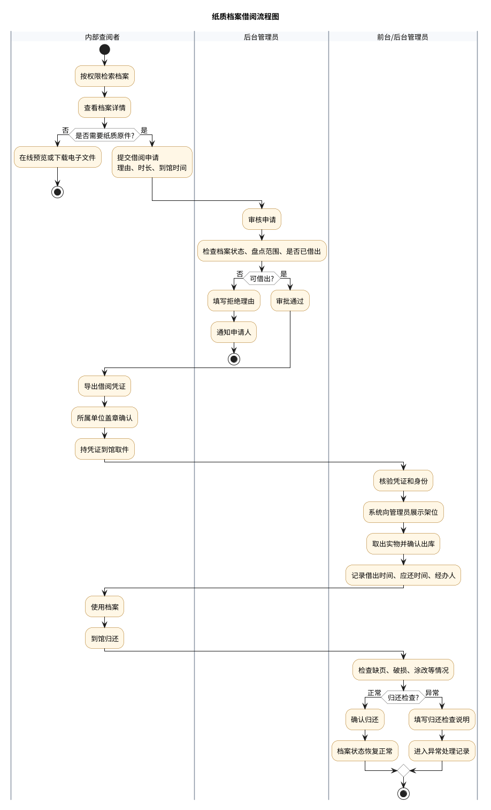

图3-9 纸质档案借阅流程图

功能要求：

1. 内部查阅者可使用普通筛选或 AI 自然语言生成查询条件。
2. AI 检索提示词注入固定分类和当前用户可见范围内的去重标签集合，不注入档案题名。
3. 后端强制按用户密级上限、所属单位或全宗范围、档案生命周期过滤结果；开放状态只控制公众公开检索，不拦截有权限的内部查阅。
4. 查阅者不显示具体库房架位，只显示是否可申请借阅。
5. 权限内电子文件可在线预览和下载，下载需记录日志。
6. 纸质原件借阅必须提交申请，由后台管理员审核。
7. 借阅审批重点检查档案是否已借出、是否在盘点/维护范围、是否可借出。
8. 审批通过后可导出借阅凭证，凭证不等于出库记录；到馆核验并点击确认出库后，档案才算实际借出。
9. 归还时必须记录归还时间和实体检查结果，异常归还需填写说明；异常归还是借阅记录终态，后续借阅由档案实体状态拦截。

### 3.4.8 公众门户

公众门户应提供首页、注册登录、公开档案检索、公开档案详情/预览、登录下载、公众概览、征集清单和下载记录等功能。

功能要求：

1. 未登录公众可检索和查看公开元数据。
2. 登录公众可下载公开电子文件，下载操作必须记录日志。
3. 公众检索后端必须强制限定非密、公开、未销毁的正式档案。
4. 公众 AI 检索提示词只能注入固定分类和公开档案去重标签集合。
5. 公众首页和公众概览只展示公开统计，不展示未公开档案的题名、档号、架位和电子文件。
6. 公众可提交征集清单，待处理清单数量和单清单条目数量按系统配置限制。

### 3.4.9 档案编研

功能要求：

1. 后台管理员可创建编研成果，填写标题、类型、时间范围、关键词、摘要。
2. 管理员通过输入档案号添加素材，系统校验档案号存在、未销毁且管理员有权查看，不能引用无权查看的档案。
3. 编研只记录素材档号和引用关系，不复制素材档案正文。
4. 管理员通过富文本编辑器撰写正文，生成 PDF 或 HTML 文件并作为草稿附件存入 MinIO。
5. 编研成果作为来源为“编研”的纯电子正式档案入库，有独立档号；入库后正文文件转为正式 `archive_files` 记录。
6. 编研成果入库后不改变素材档案的元数据、密级和公开状态。

### 3.4.10 档案鉴定与销毁

档案鉴定与销毁流程如下图所示：

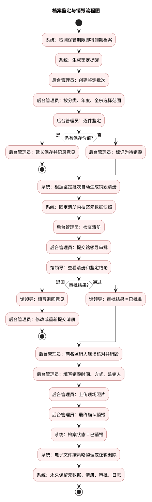

图3-10 档案鉴定与销毁流程图

功能要求：

1. 系统提前提醒保管期限即将到期档案。
2. 后台管理员可创建鉴定批次，按分类、年度、全宗筛选鉴定范围。
3. 鉴定结论包括延长保存和待销毁。
4. 待销毁档案自动进入销毁清册生成范围，清册内档案元数据快照固定。
5. 销毁清册提交馆领导审批，审批通过后进入待销毁列表。
6. 确认销毁时必须填写销毁时间、销毁方式、两名监销人，并上传现场照片。
7. 确认销毁后档案状态不可恢复。
8. 系统不删除档案元数据、销毁清册、审批记录和操作日志；电子文件可按部署策略物理删除或逻辑删除，但必须记录删除时间、执行人、哈希和原对象路径。

### 3.4.11 数据统计与数据研判

功能要求：

1. 数据统计应提供馆藏总览、本月新增、分类分布、年度趋势、纸电载体分布、密级分布、全宗分布、借阅统计和销毁统计。
2. 统计数据从正式档案、清单、借阅、销毁、审批等业务表汇总，不单独维护一套统计事实数据。
3. 数据研判应支持元数据缺失扫描、分类一致性检查、载体状态与文件/架位信息一致性检查。
4. 需要 AI 判断的研判数据按默认 50 条拆分批次，多个批次结果合并展示。
5. AI 只生成异常候选和修正建议，不自动修改正式档案。
6. 管理员确认后才能执行补充、修正或生成待办清单，所有操作留痕。

### 3.4.12 档案保存与备份

功能要求：

1. 支持查看数据库备份、电子文件备份、存储空间、最近一次校验结果。
2. 支持立即备份和定时备份任务，记录执行人、时间、类型、路径、大小、哈希和状态。
3. 支持完整性、可用性、真实性、安全性四性检测的记录和报告。
4. 真实性校验依赖外部数字签名体系，系统仅提供验签记录字段。
5. 安全性校验必须接入 ClamAV 或同等病毒扫描组件。
6. 保存管理本期只覆盖备份任务和四性检测记录。

### 3.4.13 AI 交互

AI 交互与安全边界如下图所示：

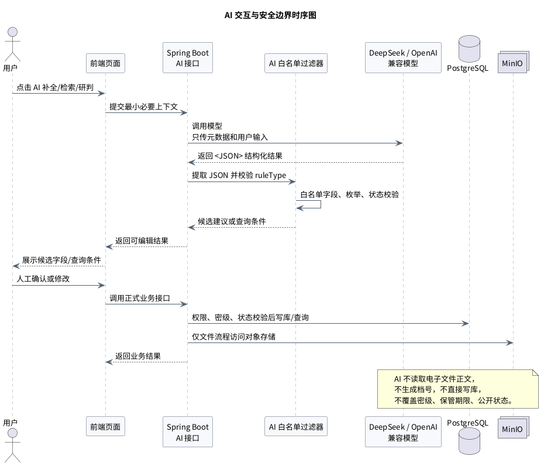

图3-11 AI 交互与安全边界时序图

功能要求：

1. AI 输出必须使用 `<JSON>` 标签包裹结构化结果。
2. 后端只提取第一组 `<JSON></JSON>` 内容并执行 JSON 格式校验、`ruleType` 校验、字段白名单校验、枚举值校验、状态校验和权限校验。
3. AI 字段补全只允许返回 `title`、`responsible`、`formedDate`、`category`、`tags`。
4. AI 结果中出现 `securityLevel`、`retentionPeriod`、`openStatus`、`allowDigitization`、`archiveNo`、`warehouseLocation`、`destructionStatus` 等字段时必须剥离或拒绝。
5. 本期 AI 只用于内部检索、公众检索、档案研判和接收清单补全 4 个入口。
6. 检索类 AI 调用为同步接口，JSON 校验失败时最多重试 3 次，仍失败则返回服务异常。
7. 档案研判和接收清单补全为异步批处理任务，默认每批 50 条，任务状态包括运行中、部分完成、全部完成和失败。
8. 批处理任务部分完成时，系统应展示成功批次、失败批次和错误摘要，并支持只重试失败批次。
9. AI 不可用时，系统回退为手工填写和手工筛选，不阻塞核心业务。

### 3.4.14 系统管理

功能要求：

1. 内部用户由系统管理员创建，公众用户可自注册。
2. 用户可绑定一个或多个角色，内部用户需配置所属单位、所属部门、联系电话、最大可查密级和数据范围。
3. 用户禁用后不可登录，但历史操作日志、审批记录、移交记录仍保留原用户信息。
4. 支持系统配置：文件格式白名单、上传大小限制、AI 功能开关、AI 批处理默认条数、AI 检索最大重试次数、公开检索开关、借阅期限、架位告警阈值、备份策略、征集捐赠在线协议文案。
5. 日志审计支持按用户、时间、模块、操作类型查询和导出，不允许在页面删除或修改日志。

## 3.5 性能需求

| 指标类别 | 指标项 | 要求 |
|----------|--------|------|
| 响应时间 | 页面首屏加载时间 | ≤ 2秒 |
| 响应时间 | 常规档案列表查询 | ≤ 1秒（100万条记录内） |
| 响应时间 | 档案详情查询 | ≤ 0.5秒 |
| 响应时间 | 文件在线预览加载 | ≤ 3秒（PDF/图片，常规大小文件） |
| 响应时间 | AI 辅助响应 | 通常≤ 15秒，超时后允许手工处理 |
| 响应时间 | 统计报表生成 | ≤ 5秒 |
| 并发能力 | 内部用户并发在线 | ≥ 20人 |
| 并发能力 | 公众用户并发访问 | ≥ 50人 |
| 存储能力 | 档案条目存储 | ≥ 25万条 |
| 存储能力 | 电子原文存储 | ≥ 1TB |
| 文件处理 | 单文件上传上限 | 默认200MB，可配置 |
| 文件处理 | 并发上传数 | ≥ 5个 |
| 可用性 | 工作时间可用性 | ≥ 99.5% |
| 备份恢复 | 数据恢复时间 | ≤ 2小时 |

**表3-5 性能需求指标表**

## 3.6 安全保密需求

1. **身份认证**：内部用户使用账号/工号和密码登录；公众用户使用手机号和密码登录；密码采用 BCrypt 哈希存储。
2. **后端鉴权**：前端菜单隐藏不能作为安全边界，所有业务接口必须在后端校验角色、权限、密级和数据范围。
3. **密级访问控制**：密级采用整数编码，`0=非密/公开 < 1=内部 < 2=秘密 < 3=机密 < 4=绝密`。内部用户按最大可查密级和数据范围过滤；公众只访问非密、公开、未销毁档案。
4. **受保护字段控制**：密级、保管期限、是否公开、是否允许数字化、档号、架位、销毁状态不得通过普通编辑和 AI 补全直接修改。
5. **文件安全**：文件上传需进行格式白名单、大小限制、哈希计算、MIME 识别和病毒扫描。文件预览和下载必须复用档案查询鉴权，通过后才生成 MinIO 临时访问地址。
6. **审批留痕**：密级调整、开放调整、销毁审批必须记录提交人、审批人、审批意见、审批时间、调整前后值和凭证档号。
7. **日志审计**：登录、登出、清单提交、验收、回退、文件上传、入库、上架、编辑、审批、下载、借阅、销毁、备份等操作必须记录日志。
8. **AI 安全边界**：AI 不读取正文，不直接写库，不删除文件，不绕过权限，不覆盖受保护字段。
9. **传输安全**：正式部署建议启用 HTTPS，API Key、数据库密码、MinIO 密钥等敏感配置通过环境变量或部署密钥管理，不写入代码仓库。

## 3.7 备份、灾备与四性检测

| 备份类型 | 备份内容 | 备份频率 | 保存周期 |
|----------|----------|----------|----------|
| 数据库全量备份 | PostgreSQL 全量导出 | 每日2:00 | 本地至少7天 |
| 文件增量备份 | MinIO 新增和变更文件 | 每日3:00 | 本地至少7天 |
| 远程备份 | 数据库和文件备份副本 | 每日同步，可选 | 远程至少30天 |
| 手动备份 | 数据库、文件或二者同时 | 按需触发 | 按配置保留 |

**表3-6 备份策略表**

四性检测要求：

1. 完整性：校验电子文件 SHA-256 哈希，检测文件是否被篡改。
2. 可用性：检测文件格式是否在白名单内，必要时基于文件头和 Apache Tika 判断 MIME 类型。
3. 真实性：预留数字签名、验签结果和验签时间字段；无外部签名体系时不强制验签。
4. 安全性：上传文件必须经 ClamAV 或同等组件扫描，记录扫描结果。

灾备要求：

1. RTO（恢复时间目标）≤ 2小时。
2. RPO（恢复点目标）≤ 24小时。
3. 突发情况下的恢复处置按线下预案执行，系统保留备份和四性检测记录作为恢复依据。

## 3.8 其它专门需求

### 3.8.1 易用性需求

1. 系统界面语言为中文，表单字段和错误提示应贴合档案业务语言。
2. 清单、回执、借阅凭证、销毁清册等应支持 PDF 导出和打印。
3. 表单支持前端实时校验和后端二次校验，错误信息应明确指出字段和原因。
4. 列表无数据时展示空态提示和可执行入口。
5. 异步操作显示进度、加载状态或任务状态。
6. AI 结果必须以“候选”方式展示，用户可修改或放弃。

### 3.8.2 可靠性需求

1. 核心业务不依赖 AI，AI 不可用不影响接收、入库、检索、借阅和审批。
2. 批次状态和条目状态需保持一致，允许批次状态由条目状态汇总计算。
3. 文件暂存转正式需采用可补偿口径，先创建正式文件记录再复制对象，失败时保留 `failed` 状态并允许后台重试。
4. 关键状态变更必须具备幂等或重复提交保护。

### 3.8.3 运行环境要求

| 类别 | 要求 |
|------|------|
| 服务器操作系统 | Linux（Ubuntu 22.04 LTS 或同等发行版） |
| Web服务器 | Nginx 1.24+ |
| 应用运行时 | JDK 17+ |
| 后端框架 | Spring Boot 3.x |
| 数据库 | PostgreSQL 17 推荐，16+ 最低 |
| 文件存储 | MinIO |
| 病毒扫描 | ClamAV |
| 前端框架 | Vue 3 + Element Plus |
| 构建工具 | Vite 7.x，Node.js 20.19+ 或 22.12+ |
| 部署方式 | Docker + docker-compose |
| 客户端浏览器 | Chrome、Edge、Firefox 最新两个大版本 |

**表3-7 运行环境要求表**

---

# 附录A：角色权限矩阵

| 功能模块 | 前台管理员 | 后台管理员 | 移交经办人 | 内部查阅者 | 社会公众 | 馆领导 | 系统管理员 |
|----------|:----------:|:----------:|:----------:|:----------:|:--------:|:------:|:----------:|
| 移交清单编制 | 查看 | 查看 | 编制/导出 | — | — | — | — |
| 征集清单提交 | 查看 | 查看 | — | — | 提交 | — | — |
| 前台验收 | 执行 | 查看 | — | — | — | — | — |
| 电子文件上传 | 执行 | 查看 | — | — | — | — | — |
| AI 补全与入库 | — | 执行 | — | — | — | — | — |
| 档案管理/整理 | 查看 | 执行 | — | — | — | — | — |
| 全宗管理 | — | 执行 | — | — | — | — | — |
| 库房管理 | 执行部分 | 执行 | — | — | — | — | — |
| 内部档案检索 | — | 执行 | — | 权限过滤 | — | 审批相关查看 | — |
| 公开档案检索 | — | 查看 | — | 可查看公开 | 公开范围 | — | — |
| 纸质借阅申请 | — | 审批 | — | 申请 | — | — | — |
| 出库/归还 | 执行 | 执行 | — | — | — | — | — |
| 编研 | — | 执行 | — | — | — | — | — |
| 鉴定 | — | 执行 | — | — | — | — | — |
| 销毁 | 协助 | 执行 | — | — | — | 审批 | — |
| 密级/开放调整 | — | 发起 | — | — | — | 审批 | — |
| 数据统计/研判 | — | 执行 | — | — | — | 查看部分 | — |
| 档案保存/备份 | — | 执行 | — | — | — | — | 配置 |
| 用户管理 | — | — | — | — | — | — | 执行 |
| 系统配置 | — | — | — | — | — | — | 执行 |
| 日志审计 | — | 查看业务日志 | — | — | — | 查看审批日志 | 执行 |

**表A-1 角色权限矩阵**

---

# 附录B：业务场景与功能映射

| 编号 | 场景名称 | 核心角色 | 主要功能模块 |
|------|----------|----------|--------------|
| 1 | 业务部门移交档案 | 小张、小陈、小刘 | 移交清单、前台验收、AI 补全、入库上架 |
| 2 | 社会征集与捐赠 | 小周、小陈、小刘 | 公众征集、征集联系、协议、验收入库 |
| 3 | 档案管理（整理、密级调整、开放调整） | 小刘、小方 | 档案管理、审批工作台 |
| 4 | 档案鉴定 | 小刘 | 鉴定批次、到期提醒 |
| 5 | 档案销毁 | 小刘、小方 | 销毁清册、审批、监销 |
| 6 | 库房管理 | 小刘 | 库房、架位、装盒上架 |
| 7 | 盘点任务 | 小刘 | 盘点任务、差异报告 |
| 8 | 借阅审批 | 小李、小刘、小陈 | 借阅申请、审批、凭证、出库归还 |
| 9 | 内部人员检索利用档案 | 小李 | 内部检索、详情预览、下载 |
| 10 | 档案编研 | 小刘 | 素材选择、富文本编撰、成果入库 |
| 11 | 公众访问与查询公开档案 | 小周 | 公众首页、公开检索、下载 |
| 12 | 统计与研判 | 小刘 | 数据统计、AI 研判 |
| 13 | 档案保存管理 | 小刘 | 备份、四性检测 |
| 14 | 系统管理员管理用户 | 系统管理员 | 用户管理、配置、日志审计 |
| 15 | 内部人员工作台 | 小李 | 最近查阅、借阅申请、下载记录 |
| 16 | 管理员后台概览 | 小刘 | 统计卡片、待办提醒、最近日志 |
| 17 | 公众概览 | 小周 | 公开统计、我的征集、下载记录 |
| 18 | 全宗管理 | 小刘 | 全宗信息、组织关联、入库归属和权限过滤 |

**表B-1 业务场景与功能映射表**

---

# 附录C：系统部署架构

系统采用 Docker 容器化部署，包含 Nginx、Spring Boot、PostgreSQL、MinIO 和 ClamAV 等核心服务。

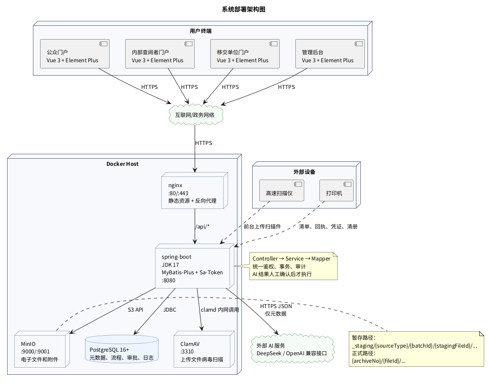

图C-1 系统部署架构图

| 服务 | 端口 | 说明 |
|------|------|------|
| nginx | 80/443 | 前端静态资源托管和 API 反向代理 |
| spring-boot | 8080 | 后端业务服务、鉴权、AI 调用、文件处理 |
| postgres | 5432 | 档案元数据、业务流程、审批和日志 |
| minio | 9000/9001 | 电子文件、扫描件、协议、照片和备份 |
| clamav | 3310 | 文件上传病毒扫描，仅容器内网访问 |

**表C-1 容器服务定义**
