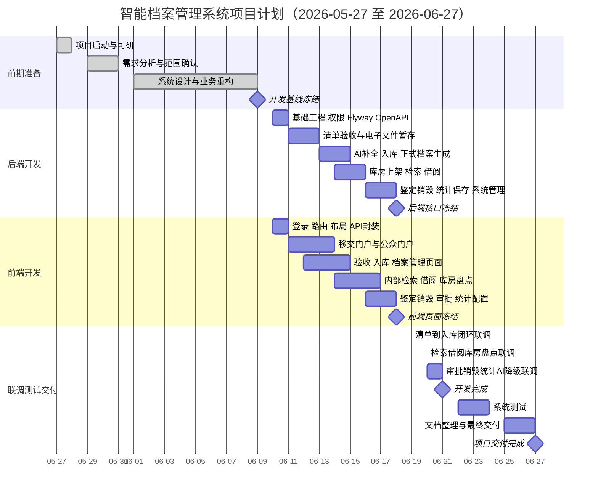
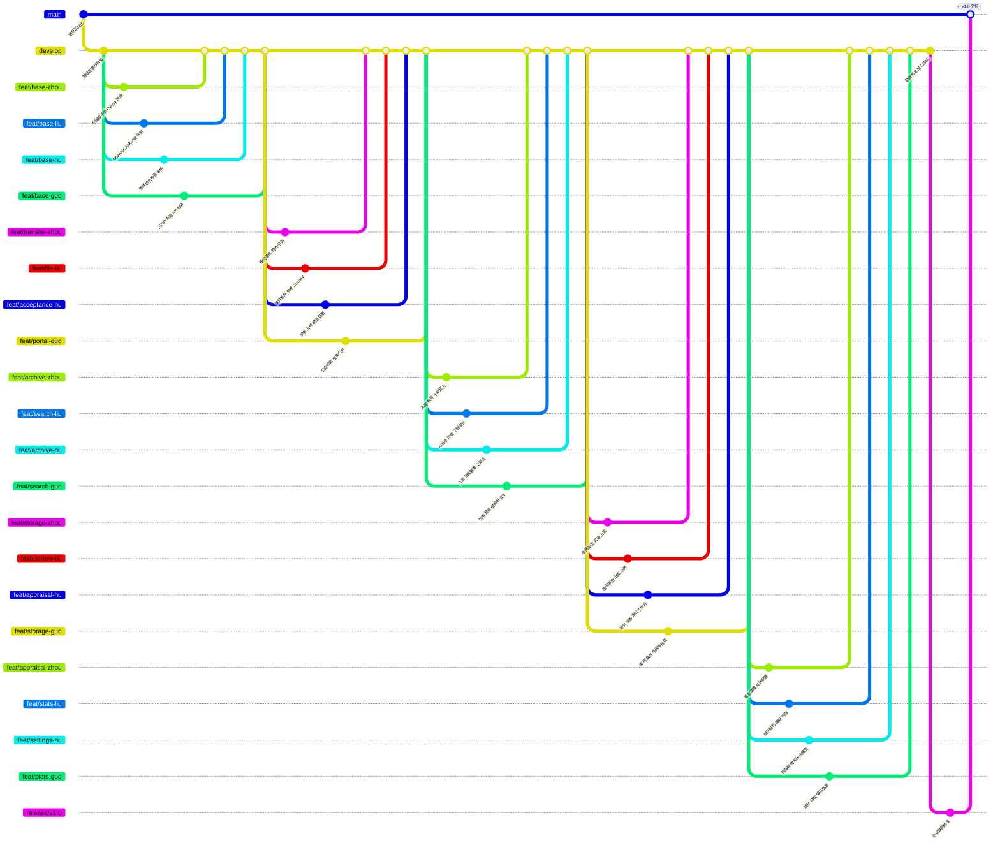

# 智能档案管理系统项目计划（交付版）

项目名称：智能档案管理系统

委托单位：克拉玛依市档案馆

承担单位：方江苏项目组

编写日期：2026年06月09日

---

## 1. 项目概述

本项目建设一套面向中小规模档案馆的智能档案管理系统，覆盖档案移交、征集、前台验收、电子文件暂存、AI 辅助补全、正式入库、装盒上架、检索利用、纸质借阅、盘点、鉴定、销毁、审批、统计研判、保存管理和系统管理等核心业务。

本版项目计划以新版业务场景重构结果为准，开发周期固定为 **2026年06月10日至2026年06月21日**。其余阶段参考旧版项目计划节奏：2026年06月22日至06月24日集中测试，2026年06月25日至06月27日文档整理、部署演示和最终交付。

### 1.1 建设目标

1. 实现“线上清单 + 线下交接 + 前台验收 + 后台入库 + 纸电融合 + 权限利用 + 审批留痕”的业务闭环。
2. 区分移交/征集清单与正式档案，清单只作为预入库数据和交接凭证，确认入库后才生成正式档号。
3. 支持纯电子、纸质+电子、纯纸质三类载体状态，并通过架位、盒号、电子文件和哈希记录形成纸电关联。
4. AI 只辅助生成候选字段、检索条件和研判建议，所有结果必须经过白名单过滤和人工确认。
5. 通过角色权限、密级过滤、下载审计、审批流程和日志留痕保障安全合规。

### 1.2 团队分工

| 角色 | 姓名 | 主要职责 |
|------|------|----------|
| 项目经理 | 方江苏 | 需求基线、计划管理、进度协调、交付文档、演示材料 |
| 后端开发 | 周扬 | 后端基础工程、清单验收、入库上架、库房、鉴定销毁、系统管理 |
| 后端开发 | 刘星 | AI 接口、检索利用、借阅、统计研判、编研保存、权限过滤 |
| 前端开发 | 胡颖 | 管理后台页面：验收、入库、档案管理、鉴定、销毁、审批、系统管理 |
| 前端开发 | 郭一坤 | 移交门户、公众门户、内部门户、检索借阅、库房盘点、统计页面 |
| 测试 | 向加明 | 测试计划、测试用例、集成测试、验收测试、缺陷跟踪 |

### 1.3 总体阶段

| 阶段 | 日期 | 关键产出 |
|------|------|----------|
| 项目启动 | 2026-05-27 至 2026-05-28 | 选题、可研报告、产品定位 |
| 需求分析 | 2026-05-29 至 2026-05-31 | 业务场景、需求说明、权限矩阵 |
| 系统设计与业务重构 | 2026-06-01 至 2026-06-09 | 技术架构、数据库设计、AI 交互架构、原型页面、开发基线 |
| 实施开发 | 2026-06-10 至 2026-06-21 | 完整可运行系统、联调版本、演示数据 |
| 系统测试 | 2026-06-22 至 2026-06-24 | 测试报告、缺陷修复、验收结论 |
| 文档与收尾 | 2026-06-25 至 2026-06-27 | 部署文档、操作手册、答辩材料、项目总结 |

## 2. 甘特图



## 3. 实施开发计划

### 3.1 开发优先级

| 优先级 | 模块 | 交付要求 |
|--------|------|----------|
| P0 | 登录权限、移交清单、前台验收、电子文件上传、AI 补全、正式入库、上架、检索、借阅、系统配置 | 必须完整闭环，联调和演示不可缺失 |
| P1 | 征集、档案管理、库房、盘点、鉴定、销毁、审批、公众检索、内部工作台 | 主流程完整，复杂边界可降级为人工处理 |
| P2 | 编研、统计研判、保存管理、AI 质量研判、部分图表与导出 | 保证基础可用，若延期则优先保留入口和核心数据 |

### 3.2 后端任务

| 日期 | 周扬 | 刘星 | 共同验收点 |
|------|------|------|------------|
| 06-10 至 06-11 | 后端脚手架、Flyway、统一响应、用户权限 | OpenAPI、AI 客户端、统一异常、接口样例 | Swagger 可访问，前端可按接口样例开发 |
| 06-11 至 06-13 | 移交/征集清单、前台验收、回退、回执 | 电子文件暂存、哈希、ClamAV、MinIO 匹配 | 清单验收与文件暂存可跑通 |
| 06-13 至 06-15 | 待入库、正式档案、档号、上架预占 | AI 补全白名单、内部/公众检索、下载审计 | 清单到正式档案闭环可跑通 |
| 06-15 至 06-16 | 库房架位、盒号、上架确认 | 借阅申请、审批、出库、归还 | 纸质档案可借阅闭环 |
| 06-16 至 06-18 | 鉴定、销毁清册、用户管理、系统配置 | 盘点、编研、统计研判、保存管理 | 06-18 完成接口冻结 |

### 3.3 前端任务

| 日期 | 胡颖 | 郭一坤 | 共同验收点 |
|------|------|--------|------------|
| 06-10 至 06-11 | 管理后台基础布局、权限菜单、公共表格表单 | 登录、移交/公众/内部门户布局、API 封装 | 所有门户可进入，菜单按角色展示 |
| 06-11 至 06-14 | 移交验收、电子文件上传、回退、回执 | 移交清单、移交工作台、公众注册、公众检索、征集 | 移交侧与公众侧主流程可操作 |
| 06-13 至 06-15 | 待入库、AI 建议确认、档案管理、上架 | 内部检索、预览、下载、借阅申请 | 入库与利用页面可联动 |
| 06-15 至 06-17 | 鉴定、销毁、审批工作台 | 库房、盘点、借阅审批、出库归还 | 库房利用与审批处置页面可联动 |
| 06-17 至 06-18 | 保存管理、用户配置、系统设置 | 统计、研判、编研、工作台补齐 | 06-18 完成页面冻结 |

### 3.4 测试与质量控制

| 时间 | 工作内容 | 负责人 | 验收标准 |
|------|----------|--------|----------|
| 06-10 至 06-21 | 测试用例与演示数据同步准备 | 向加明 | P0/P1 用例覆盖新版 18 个场景 |
| 06-19 至 06-21 | 联调冒烟测试 | 向加明、全员 | 每日输出缺陷清单，P0 缺陷不过夜 |
| 06-22 至 06-23 | 功能测试 | 向加明 | 清单入库、检索借阅、审批销毁、公众查询全部通过 |
| 06-23 至 06-24 | 集成、权限、安全和性能测试 | 向加明、方江苏 | 密级过滤、公开过滤、下载审计、上传扫描、AI 降级通过 |
| 06-24 | 验收测试与测试报告 | 向加明 | 形成测试报告和验收结论 |

## 4. 关键业务闭环

| 闭环 | 关键步骤 | 验收口径 |
|------|----------|----------|
| 移交入库闭环 | 移交单位编制清单 -> 前台验收 -> 上传电子文件 -> AI 补全 -> 后台确认入库 -> 纸质上架 | 清单和正式档案分离，正式档号只在入库时生成 |
| 征集入库闭环 | 公众提交征集清单 -> 后台联系 -> 到馆接收 -> 后台入库 | 公众侧不上传正式文件，文件由前台接收 |
| 检索利用闭环 | 内部/公众检索 -> 预览/下载 -> 访问日志 -> 纸质借阅申请 | 内部按密级与范围过滤，公众只看公开非密档案 |
| 借阅闭环 | 申请 -> 审批 -> 凭证 -> 出库 -> 归还 | 纸质档案借出后状态可追踪，归还记录留痕 |
| 鉴定销毁闭环 | 鉴定批次 -> 待销毁 -> 清册 -> 馆领导审批 -> 确认销毁 | 清册快照、审批和销毁记录永久保留 |
| 安全开放闭环 | 密级/开放调整申请 -> 凭证档号校验 -> 馆领导审批 -> 字段生效 | 受保护字段不能被普通编辑或 AI 直接覆盖 |

## 5. 里程碑

| 日期 | 里程碑 | 判定标准 |
|------|--------|----------|
| 2026-06-09 | 开发基线冻结 | 新版业务场景、数据库、技术架构、原型页面可作为开发依据 |
| 2026-06-11 | 基础工程可用 | 登录、权限、路由、OpenAPI、Flyway、统一响应完成 |
| 2026-06-15 | 核心入库链路可用 | 清单验收、文件暂存、AI 补全、正式入库、上架可跑通 |
| 2026-06-18 | 接口与页面冻结 | 后端 Swagger 和前端路由菜单完成联调前评审 |
| 2026-06-21 | 开发完成 | P0/P1 主流程完成，演示数据可运行 |
| 2026-06-24 | 测试完成 | 测试报告完成，P0/P1 缺陷关闭 |
| 2026-06-27 | 项目交付完成 | 源码、数据库脚本、部署配置、文档、演示材料齐备 |

## 6. 交付物清单

| 类别 | 交付物 |
|------|--------|
| 计划类 | 项目计划交付版、Project 导入 CSV、Git 分支与并行开发安排 |
| 需求设计类 | 业务场景、软件需求说明书、技术架构、数据库设计、AI 交互架构 |
| 原型类 | 各门户原型页面、页面设计说明、页面验收文档 |
| 代码类 | 前端源码、后端源码、数据库迁移脚本、Docker 部署配置 |
| 测试类 | 测试用例、缺陷记录、测试报告 |
| 交付展示类 | 用户操作手册、部署说明、答辩 PPT、项目总结报告、演示数据 |

## 7. Git 分支管理策略

项目采用简化 Git Flow 模型，以 `main` 为生产分支、`develop` 为开发集成分支，所有功能开发在 `feat/` 分支上进行，完成后合并回 `develop`。

### 7.1 分支类型

| 分支类型 | 命名格式 | 说明 |
|----------|----------|------|
| 生产分支 | `main` | 只接受来自 `develop` 或 `release` 的合并，每次合并打 tag |
| 开发分支 | `develop` | 日常集成，所有功能分支最终合并到这里 |
| 功能分支 | `feat/<模块>-<姓名>` | 每人每个任务模块拉一条，从 `develop` 拉出，完成后合并回 `develop` |
| 修复分支 | `fix/<描述>` | 联调或测试阶段发现缺陷时从 `develop` 拉出 |
| 发布分支 | `release/<版本>` | 测试完成后从 `develop` 拉出，只修缺陷，最终合并到 `main` 并打 tag |

### 7.2 分支命名约定

| 开发者 | 分支名 | 对应任务 |
|--------|--------|----------|
| 周扬 | `feat/base-zhou` | 后端脚手架、Flyway、统一响应、用户权限 |
| 周扬 | `feat/transfer-zhou` | 移交/征集清单、前台验收、回退、回执 |
| 周扬 | `feat/archive-zhou` | 待入库、正式档案、档号生成、上架预占 |
| 周扬 | `feat/storage-zhou` | 库房架位、盒号、上架确认 |
| 周扬 | `feat/appraisal-zhou` | 鉴定、销毁清册、用户管理、系统配置 |
| 刘星 | `feat/base-liu` | OpenAPI、AI 客户端、统一异常、接口样例 |
| 刘星 | `feat/file-liu` | 电子文件暂存、哈希、ClamAV、MinIO |
| 刘星 | `feat/search-liu` | AI 补全白名单、内部/公众检索、下载审计 |
| 刘星 | `feat/borrow-liu` | 借阅申请、审批、出库、归还 |
| 刘星 | `feat/stats-liu` | 盘点、编研、统计研判、保存管理 |
| 胡颖 | `feat/base-hu` | 管理后台基础布局、权限菜单、公共表格表单 |
| 胡颖 | `feat/acceptance-hu` | 移交验收、电子文件上传、回退、回执页面 |
| 胡颖 | `feat/archive-hu` | 待入库、AI 建议确认、档案管理、上架页面 |
| 胡颖 | `feat/appraisal-hu` | 鉴定、销毁、审批工作台页面 |
| 胡颖 | `feat/settings-hu` | 保存管理、用户配置、系统设置页面 |
| 郭一坤 | `feat/base-guo` | 登录、移交/公众/内部门户布局、API 封装 |
| 郭一坤 | `feat/portal-guo` | 移交清单、移交工作台、公众注册、公众检索、征集 |
| 郭一坤 | `feat/search-guo` | 内部检索、预览、下载、借阅申请页面 |
| 郭一坤 | `feat/storage-guo` | 库房、盘点、借阅审批、出库归还页面 |
| 郭一坤 | `feat/stats-guo` | 统计、研判、编研、工作台补齐页面 |

### 7.3 分支创建与合并流程



### 7.4 日常操作流程

**开始新任务：**

```bash
# 1. 同步最新代码
git checkout develop
git pull origin develop

# 2. 创建自己的功能分支（按 9.2 表中的命名）
git checkout -b feat/<模块>-<姓名>

# 3. 开发并提交（按 commit 规范）
git add .
git commit -m "feat(scope): 中文描述"

# 4. 推送到远端
git push origin feat/<模块>-<姓名>
```

**完成任务后合并：**

```bash
# 1. 确保本地 develop 最新
git checkout develop
git pull origin develop

# 2. 合并自己的分支
git merge feat/<模块>-<姓名>

# 3. 推送（如有冲突先在本地解决）
git push origin develop
```

**冲突处理原则：**
- 联调阶段（06-19 起）统一向 `develop` 合并，冲突由分支作者在本地解决后再推送
- 禁止 `--force` 推送到 `main` 或 `develop`
- 每天开始工作前先 `pull` 最新 `develop`，减少积压冲突
